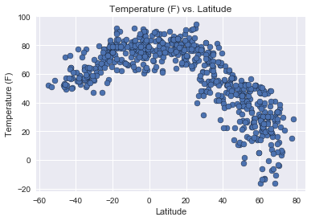
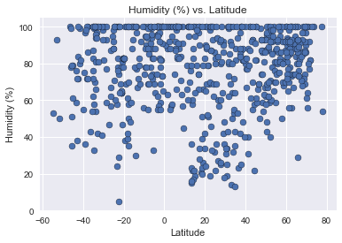
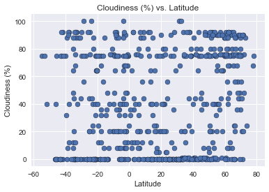
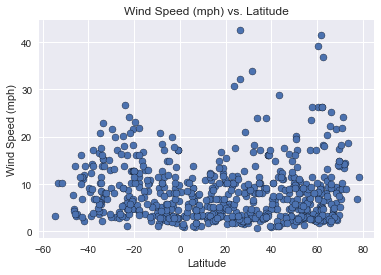

```python
# Dependencies
import json
import requests as req
import random
import seaborn as sns
import pandas as pd
import math as math
import time
import numpy as np
import matplotlib.pyplot as plt
from citipy import citipy
```

Openweather api key


```python
api_key = "478ee01ae8b8eae871901fe2bef506c7"
```

Create a pandas dataframe called location_data
Set two columns in the data frame to be random numbers for both Latitude and Longitude Values


```python
location_data = pd.DataFrame()
location_data['lat_values'] = [np.random.uniform(-90,90) for x in range(1500)]
location_data['lng_values'] = [np.random.uniform(-180, 180) for x in range(1500)]

location_data.head()#check

```


<div>
<style>
    .dataframe thead tr:only-child th {
        text-align: right;
    }

    .dataframe thead th {
        text-align: left;
    }

    .dataframe tbody tr th {
        vertical-align: top;
    }
</style>
<table border="1" class="dataframe">
  <thead>
    <tr style="text-align: right;">
      <th></th>
      <th>lat_values</th>
      <th>lng_values</th>
    </tr>
  </thead>
  <tbody>
    <tr>
      <th>0</th>
      <td>-36.982796</td>
      <td>169.481665</td>
    </tr>
    <tr>
      <th>1</th>
      <td>89.631332</td>
      <td>-171.241918</td>
    </tr>
    <tr>
      <th>2</th>
      <td>2.537869</td>
      <td>-77.424834</td>
    </tr>
    <tr>
      <th>3</th>
      <td>-71.104433</td>
      <td>-135.064140</td>
    </tr>
    <tr>
      <th>4</th>
      <td>-78.222252</td>
      <td>-69.602099</td>
    </tr>
  </tbody>
</table>
</div>


Create two more columns in location_data for city and country. Start your first for loop employing the citipy library to pic the city nearest to the previous created random values for latitude and longitude.  Get both the city name and country code and put the values in the correct columns


```python
location_data['city'] = ""
location_data['country'] = ""

count = 0
for index, row in location_data.iterrows():
    near_city = citipy.nearest_city(row['lat_values'], row['lng_values']).city_name
    near_country = citipy.nearest_city(row['lat_values'], row['lng_values']).country_code
    location_data.set_value(index,"city",near_city)
    location_data.set_value(index,"country",near_country)
location_data.head()#check    
```


<div>
<style>
    .dataframe thead tr:only-child th {
        text-align: right;
    }

    .dataframe thead th {
        text-align: left;
    }

    .dataframe tbody tr th {
        vertical-align: top;
    }
</style>
<table border="1" class="dataframe">
  <thead>
    <tr style="text-align: right;">
      <th></th>
      <th>lat_values</th>
      <th>lng_values</th>
      <th>city</th>
      <th>country</th>
    </tr>
  </thead>
  <tbody>
    <tr>
      <th>0</th>
      <td>-36.982796</td>
      <td>169.481665</td>
      <td>ahipara</td>
      <td>nz</td>
    </tr>
    <tr>
      <th>1</th>
      <td>89.631332</td>
      <td>-171.241918</td>
      <td>mys shmidta</td>
      <td>ru</td>
    </tr>
    <tr>
      <th>2</th>
      <td>2.537869</td>
      <td>-77.424834</td>
      <td>argelia</td>
      <td>co</td>
    </tr>
    <tr>
      <th>3</th>
      <td>-71.104433</td>
      <td>-135.064140</td>
      <td>rikitea</td>
      <td>pf</td>
    </tr>
    <tr>
      <th>4</th>
      <td>-78.222252</td>
      <td>-69.602099</td>
      <td>ushuaia</td>
      <td>ar</td>
    </tr>
  </tbody>
</table>
</div>


Looking at sample size of location_data


```python
len(location_data)
```


    1500


removing the duplicates of location_data based on city, and country values.  Could have used unique.


```python
location_data=location_data.drop_duplicates(['city','country'],keep = "first")
#.unique
```

Created Temperature, Humidity, Cloudiness, Wind Speed, Longitude (actual), and Latitude (actual) for location_data


```python
location_data['Temp'] = ""
location_data['Humidity'] = ""
location_data['Cloudiness'] = ""
location_data['Wind Speed'] = ""
location_data["Lat"] =""
location_data["Longitude"] =""
```

Set my sample size, created the target_url variable, and picked what types of units these values will display in


```python


# Set the sample size.
sample_size = 500

target_url = 'http://api.openweathermap.org/data/2.5/weather?q='
units = 'imperial'

```


```python
location_data.head()#check
```


<div>
<style>
    .dataframe thead tr:only-child th {
        text-align: right;
    }

    .dataframe thead th {
        text-align: left;
    }

    .dataframe tbody tr th {
        vertical-align: top;
    }
</style>
<table border="1" class="dataframe">
  <thead>
    <tr style="text-align: right;">
      <th></th>
      <th>lat_values</th>
      <th>lng_values</th>
      <th>city</th>
      <th>country</th>
      <th>Temp</th>
      <th>Humidity</th>
      <th>Cloudiness</th>
      <th>Wind Speed</th>
      <th>Lat</th>
      <th>Longitude</th>
    </tr>
  </thead>
  <tbody>
    <tr>
      <th>0</th>
      <td>-36.982796</td>
      <td>169.481665</td>
      <td>ahipara</td>
      <td>nz</td>
      <td></td>
      <td></td>
      <td></td>
      <td></td>
      <td></td>
      <td></td>
    </tr>
    <tr>
      <th>1</th>
      <td>89.631332</td>
      <td>-171.241918</td>
      <td>mys shmidta</td>
      <td>ru</td>
      <td></td>
      <td></td>
      <td></td>
      <td></td>
      <td></td>
      <td></td>
    </tr>
    <tr>
      <th>2</th>
      <td>2.537869</td>
      <td>-77.424834</td>
      <td>argelia</td>
      <td>co</td>
      <td></td>
      <td></td>
      <td></td>
      <td></td>
      <td></td>
      <td></td>
    </tr>
    <tr>
      <th>3</th>
      <td>-71.104433</td>
      <td>-135.064140</td>
      <td>rikitea</td>
      <td>pf</td>
      <td></td>
      <td></td>
      <td></td>
      <td></td>
      <td></td>
      <td></td>
    </tr>
    <tr>
      <th>4</th>
      <td>-78.222252</td>
      <td>-69.602099</td>
      <td>ushuaia</td>
      <td>ar</td>
      <td></td>
      <td></td>
      <td></td>
      <td></td>
      <td></td>
      <td></td>
    </tr>
  </tbody>
</table>
</div>


Performed API calls


```python
record = 0
for index, row in location_data.iterrows():
    city_name = row['city']
    country_code = row['country']
    url = target_url + city_name + ',' + country_code + '&units=' + units + '&APPID=' + api_key
    print (url)
    try: 
        weather_response = req.get(url)
        weather_json = weather_response.json()
        latitude = weather_json["coord"]["lat"]
        longitude = weather_json["coord"]["lon"]
        temp = weather_json["main"]["temp"]
        humidity = weather_json["main"]["humidity"]
        cloud = weather_json["clouds"]["all"]
        wind = weather_json["wind"]["speed"]
        location_data.set_value(index,"Temp", temp)
        location_data.set_value(index,"Humidity",humidity)
        location_data.set_value(index,"Wind Speed", wind)
        location_data.set_value(index,"Cloudiness",cloud)
        location_data.set_value(index,"Lat", latitude)
        location_data.set_value(index,"Longitude",longitude)
        print("Retrieved data for %s, %s" % (city_name, country_code))
    except:
        print("No data for %s, %s" % (city_name,country_code))
    record += 1
    if record % 59 == 0:
        time.sleep(60)
        
 
```

    http://api.openweathermap.org/data/2.5/weather?q=ahipara,nz&units=imperial&APPID=478ee01ae8b8eae871901fe2bef506c7
    Retrieved data for ahipara, nz
    http://api.openweathermap.org/data/2.5/weather?q=mys shmidta,ru&units=imperial&APPID=478ee01ae8b8eae871901fe2bef506c7
    Retrieved data for mys shmidta, ru
    http://api.openweathermap.org/data/2.5/weather?q=argelia,co&units=imperial&APPID=478ee01ae8b8eae871901fe2bef506c7
    Retrieved data for argelia, co
    http://api.openweathermap.org/data/2.5/weather?q=rikitea,pf&units=imperial&APPID=478ee01ae8b8eae871901fe2bef506c7
    Retrieved data for rikitea, pf
    http://api.openweathermap.org/data/2.5/weather?q=ushuaia,ar&units=imperial&APPID=478ee01ae8b8eae871901fe2bef506c7
    Retrieved data for ushuaia, ar
    http://api.openweathermap.org/data/2.5/weather?q=westport,nz&units=imperial&APPID=478ee01ae8b8eae871901fe2bef506c7
    Retrieved data for westport, nz
    http://api.openweathermap.org/data/2.5/weather?q=usinsk,ru&units=imperial&APPID=478ee01ae8b8eae871901fe2bef506c7
    Retrieved data for usinsk, ru
    http://api.openweathermap.org/data/2.5/weather?q=atuona,pf&units=imperial&APPID=478ee01ae8b8eae871901fe2bef506c7
    Retrieved data for atuona, pf
    http://api.openweathermap.org/data/2.5/weather?q=te anau,nz&units=imperial&APPID=478ee01ae8b8eae871901fe2bef506c7
    Retrieved data for te anau, nz
    http://api.openweathermap.org/data/2.5/weather?q=sitka,us&units=imperial&APPID=478ee01ae8b8eae871901fe2bef506c7
    Retrieved data for sitka, us
    http://api.openweathermap.org/data/2.5/weather?q=kapaa,us&units=imperial&APPID=478ee01ae8b8eae871901fe2bef506c7
    Retrieved data for kapaa, us
    http://api.openweathermap.org/data/2.5/weather?q=alenquer,br&units=imperial&APPID=478ee01ae8b8eae871901fe2bef506c7
    Retrieved data for alenquer, br
    http://api.openweathermap.org/data/2.5/weather?q=ahuimanu,us&units=imperial&APPID=478ee01ae8b8eae871901fe2bef506c7
    Retrieved data for ahuimanu, us
    http://api.openweathermap.org/data/2.5/weather?q=nautla,mx&units=imperial&APPID=478ee01ae8b8eae871901fe2bef506c7
    Retrieved data for nautla, mx
    http://api.openweathermap.org/data/2.5/weather?q=chuy,uy&units=imperial&APPID=478ee01ae8b8eae871901fe2bef506c7
    Retrieved data for chuy, uy
    http://api.openweathermap.org/data/2.5/weather?q=khovu-aksy,ru&units=imperial&APPID=478ee01ae8b8eae871901fe2bef506c7
    Retrieved data for khovu-aksy, ru
    http://api.openweathermap.org/data/2.5/weather?q=gusinoye ozero,ru&units=imperial&APPID=478ee01ae8b8eae871901fe2bef506c7
    Retrieved data for gusinoye ozero, ru
    http://api.openweathermap.org/data/2.5/weather?q=nanortalik,gl&units=imperial&APPID=478ee01ae8b8eae871901fe2bef506c7
    Retrieved data for nanortalik, gl
    http://api.openweathermap.org/data/2.5/weather?q=new norfolk,au&units=imperial&APPID=478ee01ae8b8eae871901fe2bef506c7
    Retrieved data for new norfolk, au
    http://api.openweathermap.org/data/2.5/weather?q=cape town,za&units=imperial&APPID=478ee01ae8b8eae871901fe2bef506c7
    Retrieved data for cape town, za
    http://api.openweathermap.org/data/2.5/weather?q=hithadhoo,mv&units=imperial&APPID=478ee01ae8b8eae871901fe2bef506c7
    Retrieved data for hithadhoo, mv
    http://api.openweathermap.org/data/2.5/weather?q=constitucion,mx&units=imperial&APPID=478ee01ae8b8eae871901fe2bef506c7
    Retrieved data for constitucion, mx
    http://api.openweathermap.org/data/2.5/weather?q=comodoro rivadavia,ar&units=imperial&APPID=478ee01ae8b8eae871901fe2bef506c7
    Retrieved data for comodoro rivadavia, ar
    http://api.openweathermap.org/data/2.5/weather?q=saint george,bm&units=imperial&APPID=478ee01ae8b8eae871901fe2bef506c7
    Retrieved data for saint george, bm
    http://api.openweathermap.org/data/2.5/weather?q=campbell river,ca&units=imperial&APPID=478ee01ae8b8eae871901fe2bef506c7
    Retrieved data for campbell river, ca
    http://api.openweathermap.org/data/2.5/weather?q=lowestoft,gb&units=imperial&APPID=478ee01ae8b8eae871901fe2bef506c7
    Retrieved data for lowestoft, gb
    http://api.openweathermap.org/data/2.5/weather?q=yellowknife,ca&units=imperial&APPID=478ee01ae8b8eae871901fe2bef506c7
    Retrieved data for yellowknife, ca
    http://api.openweathermap.org/data/2.5/weather?q=ilulissat,gl&units=imperial&APPID=478ee01ae8b8eae871901fe2bef506c7
    Retrieved data for ilulissat, gl
    http://api.openweathermap.org/data/2.5/weather?q=hit,iq&units=imperial&APPID=478ee01ae8b8eae871901fe2bef506c7
    Retrieved data for hit, iq
    http://api.openweathermap.org/data/2.5/weather?q=taolanaro,mg&units=imperial&APPID=478ee01ae8b8eae871901fe2bef506c7
    Retrieved data for taolanaro, mg
    http://api.openweathermap.org/data/2.5/weather?q=port lincoln,au&units=imperial&APPID=478ee01ae8b8eae871901fe2bef506c7
    Retrieved data for port lincoln, au
    http://api.openweathermap.org/data/2.5/weather?q=bukama,cd&units=imperial&APPID=478ee01ae8b8eae871901fe2bef506c7
    Retrieved data for bukama, cd
    http://api.openweathermap.org/data/2.5/weather?q=laguna,br&units=imperial&APPID=478ee01ae8b8eae871901fe2bef506c7
    Retrieved data for laguna, br
    http://api.openweathermap.org/data/2.5/weather?q=lebu,cl&units=imperial&APPID=478ee01ae8b8eae871901fe2bef506c7
    Retrieved data for lebu, cl
    http://api.openweathermap.org/data/2.5/weather?q=bluff,nz&units=imperial&APPID=478ee01ae8b8eae871901fe2bef506c7
    Retrieved data for bluff, nz
    http://api.openweathermap.org/data/2.5/weather?q=chute-aux-outardes,ca&units=imperial&APPID=478ee01ae8b8eae871901fe2bef506c7
    Retrieved data for chute-aux-outardes, ca
    http://api.openweathermap.org/data/2.5/weather?q=saint-joseph,re&units=imperial&APPID=478ee01ae8b8eae871901fe2bef506c7
    Retrieved data for saint-joseph, re
    http://api.openweathermap.org/data/2.5/weather?q=pangkalanbuun,id&units=imperial&APPID=478ee01ae8b8eae871901fe2bef506c7
    Retrieved data for pangkalanbuun, id
    http://api.openweathermap.org/data/2.5/weather?q=port alfred,za&units=imperial&APPID=478ee01ae8b8eae871901fe2bef506c7
    Retrieved data for port alfred, za
    http://api.openweathermap.org/data/2.5/weather?q=impfondo,cg&units=imperial&APPID=478ee01ae8b8eae871901fe2bef506c7
    Retrieved data for impfondo, cg
    http://api.openweathermap.org/data/2.5/weather?q=longyearbyen,sj&units=imperial&APPID=478ee01ae8b8eae871901fe2bef506c7
    Retrieved data for longyearbyen, sj
    http://api.openweathermap.org/data/2.5/weather?q=punta arenas,cl&units=imperial&APPID=478ee01ae8b8eae871901fe2bef506c7
    Retrieved data for punta arenas, cl
    http://api.openweathermap.org/data/2.5/weather?q=aklavik,ca&units=imperial&APPID=478ee01ae8b8eae871901fe2bef506c7
    Retrieved data for aklavik, ca
    http://api.openweathermap.org/data/2.5/weather?q=busselton,au&units=imperial&APPID=478ee01ae8b8eae871901fe2bef506c7
    Retrieved data for busselton, au
    http://api.openweathermap.org/data/2.5/weather?q=naze,jp&units=imperial&APPID=478ee01ae8b8eae871901fe2bef506c7
    Retrieved data for naze, jp
    http://api.openweathermap.org/data/2.5/weather?q=sharjah,ae&units=imperial&APPID=478ee01ae8b8eae871901fe2bef506c7
    Retrieved data for sharjah, ae
    http://api.openweathermap.org/data/2.5/weather?q=ribeira grande,pt&units=imperial&APPID=478ee01ae8b8eae871901fe2bef506c7
    Retrieved data for ribeira grande, pt
    http://api.openweathermap.org/data/2.5/weather?q=mataura,pf&units=imperial&APPID=478ee01ae8b8eae871901fe2bef506c7
    Retrieved data for mataura, pf
    http://api.openweathermap.org/data/2.5/weather?q=tsumeb,na&units=imperial&APPID=478ee01ae8b8eae871901fe2bef506c7
    Retrieved data for tsumeb, na
    http://api.openweathermap.org/data/2.5/weather?q=kurilsk,ru&units=imperial&APPID=478ee01ae8b8eae871901fe2bef506c7
    Retrieved data for kurilsk, ru
    http://api.openweathermap.org/data/2.5/weather?q=pacific grove,us&units=imperial&APPID=478ee01ae8b8eae871901fe2bef506c7
    Retrieved data for pacific grove, us
    http://api.openweathermap.org/data/2.5/weather?q=amderma,ru&units=imperial&APPID=478ee01ae8b8eae871901fe2bef506c7
    Retrieved data for amderma, ru
    http://api.openweathermap.org/data/2.5/weather?q=kahului,us&units=imperial&APPID=478ee01ae8b8eae871901fe2bef506c7
    Retrieved data for kahului, us
    http://api.openweathermap.org/data/2.5/weather?q=clyde river,ca&units=imperial&APPID=478ee01ae8b8eae871901fe2bef506c7
    Retrieved data for clyde river, ca
    http://api.openweathermap.org/data/2.5/weather?q=coihaique,cl&units=imperial&APPID=478ee01ae8b8eae871901fe2bef506c7
    Retrieved data for coihaique, cl
    http://api.openweathermap.org/data/2.5/weather?q=yandoon,mm&units=imperial&APPID=478ee01ae8b8eae871901fe2bef506c7
    Retrieved data for yandoon, mm
    http://api.openweathermap.org/data/2.5/weather?q=svetlyy,ru&units=imperial&APPID=478ee01ae8b8eae871901fe2bef506c7
    Retrieved data for svetlyy, ru
    http://api.openweathermap.org/data/2.5/weather?q=fortuna,us&units=imperial&APPID=478ee01ae8b8eae871901fe2bef506c7
    Retrieved data for fortuna, us
    http://api.openweathermap.org/data/2.5/weather?q=cidreira,br&units=imperial&APPID=478ee01ae8b8eae871901fe2bef506c7
    Retrieved data for cidreira, br
    http://api.openweathermap.org/data/2.5/weather?q=tasiilaq,gl&units=imperial&APPID=478ee01ae8b8eae871901fe2bef506c7
    Retrieved data for tasiilaq, gl
    http://api.openweathermap.org/data/2.5/weather?q=sola,vu&units=imperial&APPID=478ee01ae8b8eae871901fe2bef506c7
    Retrieved data for sola, vu
    http://api.openweathermap.org/data/2.5/weather?q=cherskiy,ru&units=imperial&APPID=478ee01ae8b8eae871901fe2bef506c7
    Retrieved data for cherskiy, ru
    http://api.openweathermap.org/data/2.5/weather?q=talhar,pk&units=imperial&APPID=478ee01ae8b8eae871901fe2bef506c7
    Retrieved data for talhar, pk
    http://api.openweathermap.org/data/2.5/weather?q=kruisfontein,za&units=imperial&APPID=478ee01ae8b8eae871901fe2bef506c7
    Retrieved data for kruisfontein, za
    http://api.openweathermap.org/data/2.5/weather?q=vlissingen,nl&units=imperial&APPID=478ee01ae8b8eae871901fe2bef506c7
    Retrieved data for vlissingen, nl
    http://api.openweathermap.org/data/2.5/weather?q=gubkinskiy,ru&units=imperial&APPID=478ee01ae8b8eae871901fe2bef506c7
    Retrieved data for gubkinskiy, ru
    http://api.openweathermap.org/data/2.5/weather?q=belushya guba,ru&units=imperial&APPID=478ee01ae8b8eae871901fe2bef506c7
    Retrieved data for belushya guba, ru
    http://api.openweathermap.org/data/2.5/weather?q=faya,td&units=imperial&APPID=478ee01ae8b8eae871901fe2bef506c7
    Retrieved data for faya, td
    http://api.openweathermap.org/data/2.5/weather?q=haibowan,cn&units=imperial&APPID=478ee01ae8b8eae871901fe2bef506c7
    Retrieved data for haibowan, cn
    http://api.openweathermap.org/data/2.5/weather?q=thunder bay,ca&units=imperial&APPID=478ee01ae8b8eae871901fe2bef506c7
    Retrieved data for thunder bay, ca
    http://api.openweathermap.org/data/2.5/weather?q=illoqqortoormiut,gl&units=imperial&APPID=478ee01ae8b8eae871901fe2bef506c7
    Retrieved data for illoqqortoormiut, gl
    http://api.openweathermap.org/data/2.5/weather?q=kodiak,us&units=imperial&APPID=478ee01ae8b8eae871901fe2bef506c7
    Retrieved data for kodiak, us
    http://api.openweathermap.org/data/2.5/weather?q=oranjemund,na&units=imperial&APPID=478ee01ae8b8eae871901fe2bef506c7
    Retrieved data for oranjemund, na
    http://api.openweathermap.org/data/2.5/weather?q=jamestown,sh&units=imperial&APPID=478ee01ae8b8eae871901fe2bef506c7
    Retrieved data for jamestown, sh
    http://api.openweathermap.org/data/2.5/weather?q=butaritari,ki&units=imperial&APPID=478ee01ae8b8eae871901fe2bef506c7
    Retrieved data for butaritari, ki
    http://api.openweathermap.org/data/2.5/weather?q=ancud,cl&units=imperial&APPID=478ee01ae8b8eae871901fe2bef506c7
    Retrieved data for ancud, cl
    http://api.openweathermap.org/data/2.5/weather?q=tuatapere,nz&units=imperial&APPID=478ee01ae8b8eae871901fe2bef506c7
    Retrieved data for tuatapere, nz
    http://api.openweathermap.org/data/2.5/weather?q=tommot,ru&units=imperial&APPID=478ee01ae8b8eae871901fe2bef506c7
    Retrieved data for tommot, ru
    http://api.openweathermap.org/data/2.5/weather?q=kieta,pg&units=imperial&APPID=478ee01ae8b8eae871901fe2bef506c7
    Retrieved data for kieta, pg
    http://api.openweathermap.org/data/2.5/weather?q=qaanaaq,gl&units=imperial&APPID=478ee01ae8b8eae871901fe2bef506c7
    Retrieved data for qaanaaq, gl
    http://api.openweathermap.org/data/2.5/weather?q=baykit,ru&units=imperial&APPID=478ee01ae8b8eae871901fe2bef506c7
    Retrieved data for baykit, ru
    http://api.openweathermap.org/data/2.5/weather?q=inhambane,mz&units=imperial&APPID=478ee01ae8b8eae871901fe2bef506c7
    Retrieved data for inhambane, mz
    http://api.openweathermap.org/data/2.5/weather?q=castro,cl&units=imperial&APPID=478ee01ae8b8eae871901fe2bef506c7
    Retrieved data for castro, cl
    http://api.openweathermap.org/data/2.5/weather?q=hobart,au&units=imperial&APPID=478ee01ae8b8eae871901fe2bef506c7
    Retrieved data for hobart, au
    http://api.openweathermap.org/data/2.5/weather?q=provideniya,ru&units=imperial&APPID=478ee01ae8b8eae871901fe2bef506c7
    Retrieved data for provideniya, ru
    http://api.openweathermap.org/data/2.5/weather?q=natal,br&units=imperial&APPID=478ee01ae8b8eae871901fe2bef506c7
    Retrieved data for natal, br
    http://api.openweathermap.org/data/2.5/weather?q=kenai,us&units=imperial&APPID=478ee01ae8b8eae871901fe2bef506c7
    Retrieved data for kenai, us
    http://api.openweathermap.org/data/2.5/weather?q=nishihara,jp&units=imperial&APPID=478ee01ae8b8eae871901fe2bef506c7
    Retrieved data for nishihara, jp
    http://api.openweathermap.org/data/2.5/weather?q=lodja,cd&units=imperial&APPID=478ee01ae8b8eae871901fe2bef506c7
    Retrieved data for lodja, cd
    http://api.openweathermap.org/data/2.5/weather?q=saint anthony,ca&units=imperial&APPID=478ee01ae8b8eae871901fe2bef506c7
    Retrieved data for saint anthony, ca
    http://api.openweathermap.org/data/2.5/weather?q=puerto ayora,ec&units=imperial&APPID=478ee01ae8b8eae871901fe2bef506c7
    Retrieved data for puerto ayora, ec
    http://api.openweathermap.org/data/2.5/weather?q=elasson,gr&units=imperial&APPID=478ee01ae8b8eae871901fe2bef506c7
    Retrieved data for elasson, gr
    http://api.openweathermap.org/data/2.5/weather?q=coquimbo,cl&units=imperial&APPID=478ee01ae8b8eae871901fe2bef506c7
    Retrieved data for coquimbo, cl
    http://api.openweathermap.org/data/2.5/weather?q=calatayud,es&units=imperial&APPID=478ee01ae8b8eae871901fe2bef506c7
    Retrieved data for calatayud, es
    http://api.openweathermap.org/data/2.5/weather?q=san patricio,mx&units=imperial&APPID=478ee01ae8b8eae871901fe2bef506c7
    Retrieved data for san patricio, mx
    http://api.openweathermap.org/data/2.5/weather?q=gobabis,na&units=imperial&APPID=478ee01ae8b8eae871901fe2bef506c7
    Retrieved data for gobabis, na
    http://api.openweathermap.org/data/2.5/weather?q=pacifica,us&units=imperial&APPID=478ee01ae8b8eae871901fe2bef506c7
    Retrieved data for pacifica, us
    http://api.openweathermap.org/data/2.5/weather?q=kalakamati,bw&units=imperial&APPID=478ee01ae8b8eae871901fe2bef506c7
    Retrieved data for kalakamati, bw
    http://api.openweathermap.org/data/2.5/weather?q=cibitoke,bi&units=imperial&APPID=478ee01ae8b8eae871901fe2bef506c7
    Retrieved data for cibitoke, bi
    http://api.openweathermap.org/data/2.5/weather?q=sibolga,id&units=imperial&APPID=478ee01ae8b8eae871901fe2bef506c7
    Retrieved data for sibolga, id
    http://api.openweathermap.org/data/2.5/weather?q=nambour,au&units=imperial&APPID=478ee01ae8b8eae871901fe2bef506c7
    Retrieved data for nambour, au
    http://api.openweathermap.org/data/2.5/weather?q=arraial do cabo,br&units=imperial&APPID=478ee01ae8b8eae871901fe2bef506c7
    Retrieved data for arraial do cabo, br
    http://api.openweathermap.org/data/2.5/weather?q=ayan,ru&units=imperial&APPID=478ee01ae8b8eae871901fe2bef506c7
    Retrieved data for ayan, ru
    http://api.openweathermap.org/data/2.5/weather?q=airai,pw&units=imperial&APPID=478ee01ae8b8eae871901fe2bef506c7
    Retrieved data for airai, pw
    http://api.openweathermap.org/data/2.5/weather?q=wageningen,sr&units=imperial&APPID=478ee01ae8b8eae871901fe2bef506c7
    Retrieved data for wageningen, sr
    http://api.openweathermap.org/data/2.5/weather?q=albany,au&units=imperial&APPID=478ee01ae8b8eae871901fe2bef506c7
    Retrieved data for albany, au
    http://api.openweathermap.org/data/2.5/weather?q=hermanus,za&units=imperial&APPID=478ee01ae8b8eae871901fe2bef506c7
    Retrieved data for hermanus, za
    http://api.openweathermap.org/data/2.5/weather?q=rakitovo,bg&units=imperial&APPID=478ee01ae8b8eae871901fe2bef506c7
    Retrieved data for rakitovo, bg
    http://api.openweathermap.org/data/2.5/weather?q=esperance,au&units=imperial&APPID=478ee01ae8b8eae871901fe2bef506c7
    Retrieved data for esperance, au
    http://api.openweathermap.org/data/2.5/weather?q=bredasdorp,za&units=imperial&APPID=478ee01ae8b8eae871901fe2bef506c7
    Retrieved data for bredasdorp, za
    http://api.openweathermap.org/data/2.5/weather?q=eureka,us&units=imperial&APPID=478ee01ae8b8eae871901fe2bef506c7
    Retrieved data for eureka, us
    http://api.openweathermap.org/data/2.5/weather?q=severo-kurilsk,ru&units=imperial&APPID=478ee01ae8b8eae871901fe2bef506c7
    Retrieved data for severo-kurilsk, ru
    http://api.openweathermap.org/data/2.5/weather?q=huarmey,pe&units=imperial&APPID=478ee01ae8b8eae871901fe2bef506c7
    Retrieved data for huarmey, pe
    http://api.openweathermap.org/data/2.5/weather?q=vaini,to&units=imperial&APPID=478ee01ae8b8eae871901fe2bef506c7
    Retrieved data for vaini, to
    http://api.openweathermap.org/data/2.5/weather?q=chapais,ca&units=imperial&APPID=478ee01ae8b8eae871901fe2bef506c7
    Retrieved data for chapais, ca
    http://api.openweathermap.org/data/2.5/weather?q=barrow,us&units=imperial&APPID=478ee01ae8b8eae871901fe2bef506c7
    Retrieved data for barrow, us
    http://api.openweathermap.org/data/2.5/weather?q=san cristobal,ec&units=imperial&APPID=478ee01ae8b8eae871901fe2bef506c7
    Retrieved data for san cristobal, ec
    http://api.openweathermap.org/data/2.5/weather?q=nizhneyansk,ru&units=imperial&APPID=478ee01ae8b8eae871901fe2bef506c7
    Retrieved data for nizhneyansk, ru
    http://api.openweathermap.org/data/2.5/weather?q=longkou,cn&units=imperial&APPID=478ee01ae8b8eae871901fe2bef506c7
    Retrieved data for longkou, cn
    http://api.openweathermap.org/data/2.5/weather?q=saint-philippe,re&units=imperial&APPID=478ee01ae8b8eae871901fe2bef506c7
    Retrieved data for saint-philippe, re
    http://api.openweathermap.org/data/2.5/weather?q=wairoa,nz&units=imperial&APPID=478ee01ae8b8eae871901fe2bef506c7
    Retrieved data for wairoa, nz
    http://api.openweathermap.org/data/2.5/weather?q=thompson,ca&units=imperial&APPID=478ee01ae8b8eae871901fe2bef506c7
    Retrieved data for thompson, ca
    http://api.openweathermap.org/data/2.5/weather?q=barentsburg,sj&units=imperial&APPID=478ee01ae8b8eae871901fe2bef506c7
    No data for barentsburg, sj
    http://api.openweathermap.org/data/2.5/weather?q=bethel,us&units=imperial&APPID=478ee01ae8b8eae871901fe2bef506c7
    Retrieved data for bethel, us
    http://api.openweathermap.org/data/2.5/weather?q=namatanai,pg&units=imperial&APPID=478ee01ae8b8eae871901fe2bef506c7
    Retrieved data for namatanai, pg
    http://api.openweathermap.org/data/2.5/weather?q=sovetskiy,ru&units=imperial&APPID=478ee01ae8b8eae871901fe2bef506c7
    Retrieved data for sovetskiy, ru
    http://api.openweathermap.org/data/2.5/weather?q=iqaluit,ca&units=imperial&APPID=478ee01ae8b8eae871901fe2bef506c7
    Retrieved data for iqaluit, ca
    http://api.openweathermap.org/data/2.5/weather?q=ca mau,vn&units=imperial&APPID=478ee01ae8b8eae871901fe2bef506c7
    Retrieved data for ca mau, vn
    http://api.openweathermap.org/data/2.5/weather?q=vila velha,br&units=imperial&APPID=478ee01ae8b8eae871901fe2bef506c7
    Retrieved data for vila velha, br
    http://api.openweathermap.org/data/2.5/weather?q=rakovski,bg&units=imperial&APPID=478ee01ae8b8eae871901fe2bef506c7
    Retrieved data for rakovski, bg
    http://api.openweathermap.org/data/2.5/weather?q=san diego de los banos,cu&units=imperial&APPID=478ee01ae8b8eae871901fe2bef506c7
    Retrieved data for san diego de los banos, cu
    http://api.openweathermap.org/data/2.5/weather?q=araouane,ml&units=imperial&APPID=478ee01ae8b8eae871901fe2bef506c7
    Retrieved data for araouane, ml
    http://api.openweathermap.org/data/2.5/weather?q=celestun,mx&units=imperial&APPID=478ee01ae8b8eae871901fe2bef506c7
    Retrieved data for celestun, mx
    http://api.openweathermap.org/data/2.5/weather?q=puerto baquerizo moreno,ec&units=imperial&APPID=478ee01ae8b8eae871901fe2bef506c7
    Retrieved data for puerto baquerizo moreno, ec
    http://api.openweathermap.org/data/2.5/weather?q=umm kaddadah,sd&units=imperial&APPID=478ee01ae8b8eae871901fe2bef506c7
    Retrieved data for umm kaddadah, sd
    http://api.openweathermap.org/data/2.5/weather?q=porto novo,cv&units=imperial&APPID=478ee01ae8b8eae871901fe2bef506c7
    Retrieved data for porto novo, cv
    http://api.openweathermap.org/data/2.5/weather?q=roma,au&units=imperial&APPID=478ee01ae8b8eae871901fe2bef506c7
    Retrieved data for roma, au
    http://api.openweathermap.org/data/2.5/weather?q=lolua,tv&units=imperial&APPID=478ee01ae8b8eae871901fe2bef506c7
    Retrieved data for lolua, tv
    http://api.openweathermap.org/data/2.5/weather?q=georgetown,sh&units=imperial&APPID=478ee01ae8b8eae871901fe2bef506c7
    Retrieved data for georgetown, sh
    http://api.openweathermap.org/data/2.5/weather?q=bilma,ne&units=imperial&APPID=478ee01ae8b8eae871901fe2bef506c7
    Retrieved data for bilma, ne
    http://api.openweathermap.org/data/2.5/weather?q=magadan,ru&units=imperial&APPID=478ee01ae8b8eae871901fe2bef506c7
    Retrieved data for magadan, ru
    http://api.openweathermap.org/data/2.5/weather?q=port elizabeth,za&units=imperial&APPID=478ee01ae8b8eae871901fe2bef506c7
    Retrieved data for port elizabeth, za
    http://api.openweathermap.org/data/2.5/weather?q=rio gallegos,ar&units=imperial&APPID=478ee01ae8b8eae871901fe2bef506c7
    Retrieved data for rio gallegos, ar
    http://api.openweathermap.org/data/2.5/weather?q=marawi,sd&units=imperial&APPID=478ee01ae8b8eae871901fe2bef506c7
    Retrieved data for marawi, sd
    http://api.openweathermap.org/data/2.5/weather?q=wuning,cn&units=imperial&APPID=478ee01ae8b8eae871901fe2bef506c7
    Retrieved data for wuning, cn
    http://api.openweathermap.org/data/2.5/weather?q=yeppoon,au&units=imperial&APPID=478ee01ae8b8eae871901fe2bef506c7
    Retrieved data for yeppoon, au
    http://api.openweathermap.org/data/2.5/weather?q=college place,us&units=imperial&APPID=478ee01ae8b8eae871901fe2bef506c7
    Retrieved data for college place, us
    http://api.openweathermap.org/data/2.5/weather?q=solnechnyy,ru&units=imperial&APPID=478ee01ae8b8eae871901fe2bef506c7
    Retrieved data for solnechnyy, ru
    http://api.openweathermap.org/data/2.5/weather?q=el balyana,eg&units=imperial&APPID=478ee01ae8b8eae871901fe2bef506c7
    Retrieved data for el balyana, eg
    http://api.openweathermap.org/data/2.5/weather?q=wittenheim,fr&units=imperial&APPID=478ee01ae8b8eae871901fe2bef506c7
    Retrieved data for wittenheim, fr
    http://api.openweathermap.org/data/2.5/weather?q=marcona,pe&units=imperial&APPID=478ee01ae8b8eae871901fe2bef506c7
    Retrieved data for marcona, pe
    http://api.openweathermap.org/data/2.5/weather?q=saldanha,za&units=imperial&APPID=478ee01ae8b8eae871901fe2bef506c7
    Retrieved data for saldanha, za
    http://api.openweathermap.org/data/2.5/weather?q=kangaatsiaq,gl&units=imperial&APPID=478ee01ae8b8eae871901fe2bef506c7
    Retrieved data for kangaatsiaq, gl
    http://api.openweathermap.org/data/2.5/weather?q=vao,nc&units=imperial&APPID=478ee01ae8b8eae871901fe2bef506c7
    Retrieved data for vao, nc
    http://api.openweathermap.org/data/2.5/weather?q=meulaboh,id&units=imperial&APPID=478ee01ae8b8eae871901fe2bef506c7
    Retrieved data for meulaboh, id
    http://api.openweathermap.org/data/2.5/weather?q=ivajlovgrad,bg&units=imperial&APPID=478ee01ae8b8eae871901fe2bef506c7
    Retrieved data for ivajlovgrad, bg
    http://api.openweathermap.org/data/2.5/weather?q=yagodnoye,ru&units=imperial&APPID=478ee01ae8b8eae871901fe2bef506c7
    Retrieved data for yagodnoye, ru
    http://api.openweathermap.org/data/2.5/weather?q=anadyr,ru&units=imperial&APPID=478ee01ae8b8eae871901fe2bef506c7
    Retrieved data for anadyr, ru
    http://api.openweathermap.org/data/2.5/weather?q=chicama,pe&units=imperial&APPID=478ee01ae8b8eae871901fe2bef506c7
    Retrieved data for chicama, pe
    http://api.openweathermap.org/data/2.5/weather?q=caravelas,br&units=imperial&APPID=478ee01ae8b8eae871901fe2bef506c7
    Retrieved data for caravelas, br
    http://api.openweathermap.org/data/2.5/weather?q=tilichiki,ru&units=imperial&APPID=478ee01ae8b8eae871901fe2bef506c7
    Retrieved data for tilichiki, ru
    http://api.openweathermap.org/data/2.5/weather?q=general roca,ar&units=imperial&APPID=478ee01ae8b8eae871901fe2bef506c7
    Retrieved data for general roca, ar
    http://api.openweathermap.org/data/2.5/weather?q=barreirinhas,br&units=imperial&APPID=478ee01ae8b8eae871901fe2bef506c7
    Retrieved data for barreirinhas, br
    http://api.openweathermap.org/data/2.5/weather?q=broome,au&units=imperial&APPID=478ee01ae8b8eae871901fe2bef506c7
    Retrieved data for broome, au
    http://api.openweathermap.org/data/2.5/weather?q=azimur,ma&units=imperial&APPID=478ee01ae8b8eae871901fe2bef506c7
    Retrieved data for azimur, ma
    http://api.openweathermap.org/data/2.5/weather?q=paamiut,gl&units=imperial&APPID=478ee01ae8b8eae871901fe2bef506c7
    Retrieved data for paamiut, gl
    http://api.openweathermap.org/data/2.5/weather?q=ballina,ie&units=imperial&APPID=478ee01ae8b8eae871901fe2bef506c7
    Retrieved data for ballina, ie
    http://api.openweathermap.org/data/2.5/weather?q=adrar,dz&units=imperial&APPID=478ee01ae8b8eae871901fe2bef506c7
    Retrieved data for adrar, dz
    http://api.openweathermap.org/data/2.5/weather?q=carnarvon,au&units=imperial&APPID=478ee01ae8b8eae871901fe2bef506c7
    Retrieved data for carnarvon, au
    http://api.openweathermap.org/data/2.5/weather?q=kolda,sn&units=imperial&APPID=478ee01ae8b8eae871901fe2bef506c7
    Retrieved data for kolda, sn
    http://api.openweathermap.org/data/2.5/weather?q=namibe,ao&units=imperial&APPID=478ee01ae8b8eae871901fe2bef506c7
    Retrieved data for namibe, ao
    http://api.openweathermap.org/data/2.5/weather?q=emerald,au&units=imperial&APPID=478ee01ae8b8eae871901fe2bef506c7
    Retrieved data for emerald, au
    http://api.openweathermap.org/data/2.5/weather?q=talnakh,ru&units=imperial&APPID=478ee01ae8b8eae871901fe2bef506c7
    Retrieved data for talnakh, ru
    http://api.openweathermap.org/data/2.5/weather?q=avarua,ck&units=imperial&APPID=478ee01ae8b8eae871901fe2bef506c7
    Retrieved data for avarua, ck
    http://api.openweathermap.org/data/2.5/weather?q=swinoujscie,pl&units=imperial&APPID=478ee01ae8b8eae871901fe2bef506c7
    Retrieved data for swinoujscie, pl
    http://api.openweathermap.org/data/2.5/weather?q=arlit,ne&units=imperial&APPID=478ee01ae8b8eae871901fe2bef506c7
    Retrieved data for arlit, ne
    http://api.openweathermap.org/data/2.5/weather?q=saskylakh,ru&units=imperial&APPID=478ee01ae8b8eae871901fe2bef506c7
    Retrieved data for saskylakh, ru
    http://api.openweathermap.org/data/2.5/weather?q=lovozero,ru&units=imperial&APPID=478ee01ae8b8eae871901fe2bef506c7
    Retrieved data for lovozero, ru
    http://api.openweathermap.org/data/2.5/weather?q=apiai,br&units=imperial&APPID=478ee01ae8b8eae871901fe2bef506c7
    Retrieved data for apiai, br
    http://api.openweathermap.org/data/2.5/weather?q=sabang,id&units=imperial&APPID=478ee01ae8b8eae871901fe2bef506c7
    Retrieved data for sabang, id
    http://api.openweathermap.org/data/2.5/weather?q=toumodi,ci&units=imperial&APPID=478ee01ae8b8eae871901fe2bef506c7
    Retrieved data for toumodi, ci
    http://api.openweathermap.org/data/2.5/weather?q=mahebourg,mu&units=imperial&APPID=478ee01ae8b8eae871901fe2bef506c7
    Retrieved data for mahebourg, mu
    http://api.openweathermap.org/data/2.5/weather?q=east london,za&units=imperial&APPID=478ee01ae8b8eae871901fe2bef506c7
    Retrieved data for east london, za
    http://api.openweathermap.org/data/2.5/weather?q=puerto narino,co&units=imperial&APPID=478ee01ae8b8eae871901fe2bef506c7
    Retrieved data for puerto narino, co
    http://api.openweathermap.org/data/2.5/weather?q=omsukchan,ru&units=imperial&APPID=478ee01ae8b8eae871901fe2bef506c7
    Retrieved data for omsukchan, ru
    http://api.openweathermap.org/data/2.5/weather?q=tuktoyaktuk,ca&units=imperial&APPID=478ee01ae8b8eae871901fe2bef506c7
    Retrieved data for tuktoyaktuk, ca
    http://api.openweathermap.org/data/2.5/weather?q=nikolskoye,ru&units=imperial&APPID=478ee01ae8b8eae871901fe2bef506c7
    Retrieved data for nikolskoye, ru
    http://api.openweathermap.org/data/2.5/weather?q=guicheng,cn&units=imperial&APPID=478ee01ae8b8eae871901fe2bef506c7
    Retrieved data for guicheng, cn
    http://api.openweathermap.org/data/2.5/weather?q=vestmanna,fo&units=imperial&APPID=478ee01ae8b8eae871901fe2bef506c7
    Retrieved data for vestmanna, fo
    http://api.openweathermap.org/data/2.5/weather?q=katsuura,jp&units=imperial&APPID=478ee01ae8b8eae871901fe2bef506c7
    Retrieved data for katsuura, jp
    http://api.openweathermap.org/data/2.5/weather?q=kyren,ru&units=imperial&APPID=478ee01ae8b8eae871901fe2bef506c7
    Retrieved data for kyren, ru
    http://api.openweathermap.org/data/2.5/weather?q=soyo,ao&units=imperial&APPID=478ee01ae8b8eae871901fe2bef506c7
    Retrieved data for soyo, ao
    http://api.openweathermap.org/data/2.5/weather?q=bambanglipuro,id&units=imperial&APPID=478ee01ae8b8eae871901fe2bef506c7
    Retrieved data for bambanglipuro, id
    http://api.openweathermap.org/data/2.5/weather?q=ankara,tr&units=imperial&APPID=478ee01ae8b8eae871901fe2bef506c7
    Retrieved data for ankara, tr
    http://api.openweathermap.org/data/2.5/weather?q=honiara,sb&units=imperial&APPID=478ee01ae8b8eae871901fe2bef506c7
    Retrieved data for honiara, sb
    http://api.openweathermap.org/data/2.5/weather?q=santa cruz,cl&units=imperial&APPID=478ee01ae8b8eae871901fe2bef506c7
    Retrieved data for santa cruz, cl
    http://api.openweathermap.org/data/2.5/weather?q=samusu,ws&units=imperial&APPID=478ee01ae8b8eae871901fe2bef506c7
    Retrieved data for samusu, ws
    http://api.openweathermap.org/data/2.5/weather?q=russell,nz&units=imperial&APPID=478ee01ae8b8eae871901fe2bef506c7
    Retrieved data for russell, nz
    http://api.openweathermap.org/data/2.5/weather?q=horta,pt&units=imperial&APPID=478ee01ae8b8eae871901fe2bef506c7
    Retrieved data for horta, pt
    http://api.openweathermap.org/data/2.5/weather?q=puerto quijarro,bo&units=imperial&APPID=478ee01ae8b8eae871901fe2bef506c7
    Retrieved data for puerto quijarro, bo
    http://api.openweathermap.org/data/2.5/weather?q=siilinjarvi,fi&units=imperial&APPID=478ee01ae8b8eae871901fe2bef506c7
    Retrieved data for siilinjarvi, fi
    http://api.openweathermap.org/data/2.5/weather?q=victoria,sc&units=imperial&APPID=478ee01ae8b8eae871901fe2bef506c7
    Retrieved data for victoria, sc
    http://api.openweathermap.org/data/2.5/weather?q=nova bana,sk&units=imperial&APPID=478ee01ae8b8eae871901fe2bef506c7
    Retrieved data for nova bana, sk
    http://api.openweathermap.org/data/2.5/weather?q=whitefish,us&units=imperial&APPID=478ee01ae8b8eae871901fe2bef506c7
    Retrieved data for whitefish, us
    http://api.openweathermap.org/data/2.5/weather?q=sentyabrskiy,ru&units=imperial&APPID=478ee01ae8b8eae871901fe2bef506c7
    Retrieved data for sentyabrskiy, ru
    http://api.openweathermap.org/data/2.5/weather?q=tezu,in&units=imperial&APPID=478ee01ae8b8eae871901fe2bef506c7
    Retrieved data for tezu, in
    http://api.openweathermap.org/data/2.5/weather?q=isangel,vu&units=imperial&APPID=478ee01ae8b8eae871901fe2bef506c7
    Retrieved data for isangel, vu
    http://api.openweathermap.org/data/2.5/weather?q=khatanga,ru&units=imperial&APPID=478ee01ae8b8eae871901fe2bef506c7
    Retrieved data for khatanga, ru
    http://api.openweathermap.org/data/2.5/weather?q=homer,us&units=imperial&APPID=478ee01ae8b8eae871901fe2bef506c7
    Retrieved data for homer, us
    http://api.openweathermap.org/data/2.5/weather?q=balykshi,kz&units=imperial&APPID=478ee01ae8b8eae871901fe2bef506c7
    Retrieved data for balykshi, kz
    http://api.openweathermap.org/data/2.5/weather?q=panzhihua,cn&units=imperial&APPID=478ee01ae8b8eae871901fe2bef506c7
    Retrieved data for panzhihua, cn
    http://api.openweathermap.org/data/2.5/weather?q=kostomuksha,ru&units=imperial&APPID=478ee01ae8b8eae871901fe2bef506c7
    Retrieved data for kostomuksha, ru
    http://api.openweathermap.org/data/2.5/weather?q=norman wells,ca&units=imperial&APPID=478ee01ae8b8eae871901fe2bef506c7
    Retrieved data for norman wells, ca
    http://api.openweathermap.org/data/2.5/weather?q=opuwo,na&units=imperial&APPID=478ee01ae8b8eae871901fe2bef506c7
    Retrieved data for opuwo, na
    http://api.openweathermap.org/data/2.5/weather?q=hilo,us&units=imperial&APPID=478ee01ae8b8eae871901fe2bef506c7
    Retrieved data for hilo, us
    http://api.openweathermap.org/data/2.5/weather?q=ostrovnoy,ru&units=imperial&APPID=478ee01ae8b8eae871901fe2bef506c7
    Retrieved data for ostrovnoy, ru
    http://api.openweathermap.org/data/2.5/weather?q=maniitsoq,gl&units=imperial&APPID=478ee01ae8b8eae871901fe2bef506c7
    Retrieved data for maniitsoq, gl
    http://api.openweathermap.org/data/2.5/weather?q=yenangyaung,mm&units=imperial&APPID=478ee01ae8b8eae871901fe2bef506c7
    Retrieved data for yenangyaung, mm
    http://api.openweathermap.org/data/2.5/weather?q=luganville,vu&units=imperial&APPID=478ee01ae8b8eae871901fe2bef506c7
    Retrieved data for luganville, vu
    http://api.openweathermap.org/data/2.5/weather?q=te horo,nz&units=imperial&APPID=478ee01ae8b8eae871901fe2bef506c7
    Retrieved data for te horo, nz
    http://api.openweathermap.org/data/2.5/weather?q=pisco,pe&units=imperial&APPID=478ee01ae8b8eae871901fe2bef506c7
    Retrieved data for pisco, pe
    http://api.openweathermap.org/data/2.5/weather?q=jomalig,ph&units=imperial&APPID=478ee01ae8b8eae871901fe2bef506c7
    Retrieved data for jomalig, ph
    http://api.openweathermap.org/data/2.5/weather?q=riyadh,sa&units=imperial&APPID=478ee01ae8b8eae871901fe2bef506c7
    Retrieved data for riyadh, sa
    http://api.openweathermap.org/data/2.5/weather?q=san blas,mx&units=imperial&APPID=478ee01ae8b8eae871901fe2bef506c7
    Retrieved data for san blas, mx
    http://api.openweathermap.org/data/2.5/weather?q=thinadhoo,mv&units=imperial&APPID=478ee01ae8b8eae871901fe2bef506c7
    Retrieved data for thinadhoo, mv
    http://api.openweathermap.org/data/2.5/weather?q=kodinar,in&units=imperial&APPID=478ee01ae8b8eae871901fe2bef506c7
    Retrieved data for kodinar, in
    http://api.openweathermap.org/data/2.5/weather?q=biak,id&units=imperial&APPID=478ee01ae8b8eae871901fe2bef506c7
    Retrieved data for biak, id
    http://api.openweathermap.org/data/2.5/weather?q=mount gambier,au&units=imperial&APPID=478ee01ae8b8eae871901fe2bef506c7
    Retrieved data for mount gambier, au
    http://api.openweathermap.org/data/2.5/weather?q=lebedinyy,ru&units=imperial&APPID=478ee01ae8b8eae871901fe2bef506c7
    Retrieved data for lebedinyy, ru
    http://api.openweathermap.org/data/2.5/weather?q=palora,ec&units=imperial&APPID=478ee01ae8b8eae871901fe2bef506c7
    Retrieved data for palora, ec
    http://api.openweathermap.org/data/2.5/weather?q=safford,us&units=imperial&APPID=478ee01ae8b8eae871901fe2bef506c7
    Retrieved data for safford, us
    http://api.openweathermap.org/data/2.5/weather?q=maragogi,br&units=imperial&APPID=478ee01ae8b8eae871901fe2bef506c7
    Retrieved data for maragogi, br
    http://api.openweathermap.org/data/2.5/weather?q=beba,eg&units=imperial&APPID=478ee01ae8b8eae871901fe2bef506c7
    Retrieved data for beba, eg
    http://api.openweathermap.org/data/2.5/weather?q=bani walid,ly&units=imperial&APPID=478ee01ae8b8eae871901fe2bef506c7
    Retrieved data for bani walid, ly
    http://api.openweathermap.org/data/2.5/weather?q=luang prabang,la&units=imperial&APPID=478ee01ae8b8eae871901fe2bef506c7
    Retrieved data for luang prabang, la
    http://api.openweathermap.org/data/2.5/weather?q=tiksi,ru&units=imperial&APPID=478ee01ae8b8eae871901fe2bef506c7
    Retrieved data for tiksi, ru
    http://api.openweathermap.org/data/2.5/weather?q=nizhniy tsasuchey,ru&units=imperial&APPID=478ee01ae8b8eae871901fe2bef506c7
    Retrieved data for nizhniy tsasuchey, ru
    http://api.openweathermap.org/data/2.5/weather?q=vaitupu,wf&units=imperial&APPID=478ee01ae8b8eae871901fe2bef506c7
    Retrieved data for vaitupu, wf
    http://api.openweathermap.org/data/2.5/weather?q=saint-pierre,re&units=imperial&APPID=478ee01ae8b8eae871901fe2bef506c7
    Retrieved data for saint-pierre, re
    http://api.openweathermap.org/data/2.5/weather?q=abu kamal,sy&units=imperial&APPID=478ee01ae8b8eae871901fe2bef506c7
    No data for abu kamal, sy
    http://api.openweathermap.org/data/2.5/weather?q=erdenet,mn&units=imperial&APPID=478ee01ae8b8eae871901fe2bef506c7
    Retrieved data for erdenet, mn
    http://api.openweathermap.org/data/2.5/weather?q=dikson,ru&units=imperial&APPID=478ee01ae8b8eae871901fe2bef506c7
    Retrieved data for dikson, ru
    http://api.openweathermap.org/data/2.5/weather?q=narsaq,gl&units=imperial&APPID=478ee01ae8b8eae871901fe2bef506c7
    Retrieved data for narsaq, gl
    http://api.openweathermap.org/data/2.5/weather?q=tolaga bay,nz&units=imperial&APPID=478ee01ae8b8eae871901fe2bef506c7
    Retrieved data for tolaga bay, nz
    http://api.openweathermap.org/data/2.5/weather?q=tsihombe,mg&units=imperial&APPID=478ee01ae8b8eae871901fe2bef506c7
    Retrieved data for tsihombe, mg
    http://api.openweathermap.org/data/2.5/weather?q=rawson,ar&units=imperial&APPID=478ee01ae8b8eae871901fe2bef506c7
    Retrieved data for rawson, ar
    http://api.openweathermap.org/data/2.5/weather?q=nalut,ly&units=imperial&APPID=478ee01ae8b8eae871901fe2bef506c7
    Retrieved data for nalut, ly
    http://api.openweathermap.org/data/2.5/weather?q=drammen,no&units=imperial&APPID=478ee01ae8b8eae871901fe2bef506c7
    Retrieved data for drammen, no
    http://api.openweathermap.org/data/2.5/weather?q=auch,fr&units=imperial&APPID=478ee01ae8b8eae871901fe2bef506c7
    Retrieved data for auch, fr
    http://api.openweathermap.org/data/2.5/weather?q=flinders,au&units=imperial&APPID=478ee01ae8b8eae871901fe2bef506c7
    Retrieved data for flinders, au
    http://api.openweathermap.org/data/2.5/weather?q=sao felix do xingu,br&units=imperial&APPID=478ee01ae8b8eae871901fe2bef506c7
    Retrieved data for sao felix do xingu, br
    http://api.openweathermap.org/data/2.5/weather?q=luwuk,id&units=imperial&APPID=478ee01ae8b8eae871901fe2bef506c7
    Retrieved data for luwuk, id
    http://api.openweathermap.org/data/2.5/weather?q=jalu,ly&units=imperial&APPID=478ee01ae8b8eae871901fe2bef506c7
    Retrieved data for jalu, ly
    http://api.openweathermap.org/data/2.5/weather?q=santander,es&units=imperial&APPID=478ee01ae8b8eae871901fe2bef506c7
    Retrieved data for santander, es
    http://api.openweathermap.org/data/2.5/weather?q=tessalit,ml&units=imperial&APPID=478ee01ae8b8eae871901fe2bef506c7
    Retrieved data for tessalit, ml
    http://api.openweathermap.org/data/2.5/weather?q=kailua,us&units=imperial&APPID=478ee01ae8b8eae871901fe2bef506c7
    Retrieved data for kailua, us
    http://api.openweathermap.org/data/2.5/weather?q=faanui,pf&units=imperial&APPID=478ee01ae8b8eae871901fe2bef506c7
    Retrieved data for faanui, pf
    http://api.openweathermap.org/data/2.5/weather?q=lumeje,ao&units=imperial&APPID=478ee01ae8b8eae871901fe2bef506c7
    Retrieved data for lumeje, ao
    http://api.openweathermap.org/data/2.5/weather?q=simbahan,ph&units=imperial&APPID=478ee01ae8b8eae871901fe2bef506c7
    Retrieved data for simbahan, ph
    http://api.openweathermap.org/data/2.5/weather?q=alofi,nu&units=imperial&APPID=478ee01ae8b8eae871901fe2bef506c7
    Retrieved data for alofi, nu
    http://api.openweathermap.org/data/2.5/weather?q=aitape,pg&units=imperial&APPID=478ee01ae8b8eae871901fe2bef506c7
    Retrieved data for aitape, pg
    http://api.openweathermap.org/data/2.5/weather?q=lavrentiya,ru&units=imperial&APPID=478ee01ae8b8eae871901fe2bef506c7
    Retrieved data for lavrentiya, ru
    http://api.openweathermap.org/data/2.5/weather?q=brae,gb&units=imperial&APPID=478ee01ae8b8eae871901fe2bef506c7
    Retrieved data for brae, gb
    http://api.openweathermap.org/data/2.5/weather?q=rehoboth,na&units=imperial&APPID=478ee01ae8b8eae871901fe2bef506c7
    Retrieved data for rehoboth, na
    http://api.openweathermap.org/data/2.5/weather?q=lompoc,us&units=imperial&APPID=478ee01ae8b8eae871901fe2bef506c7
    Retrieved data for lompoc, us
    http://api.openweathermap.org/data/2.5/weather?q=polunochnoye,ru&units=imperial&APPID=478ee01ae8b8eae871901fe2bef506c7
    Retrieved data for polunochnoye, ru
    http://api.openweathermap.org/data/2.5/weather?q=troitskoye,ru&units=imperial&APPID=478ee01ae8b8eae871901fe2bef506c7
    Retrieved data for troitskoye, ru
    http://api.openweathermap.org/data/2.5/weather?q=port-cartier,ca&units=imperial&APPID=478ee01ae8b8eae871901fe2bef506c7
    Retrieved data for port-cartier, ca
    http://api.openweathermap.org/data/2.5/weather?q=martapura,id&units=imperial&APPID=478ee01ae8b8eae871901fe2bef506c7
    Retrieved data for martapura, id
    http://api.openweathermap.org/data/2.5/weather?q=kamenka,ru&units=imperial&APPID=478ee01ae8b8eae871901fe2bef506c7
    Retrieved data for kamenka, ru
    http://api.openweathermap.org/data/2.5/weather?q=toktogul,kg&units=imperial&APPID=478ee01ae8b8eae871901fe2bef506c7
    Retrieved data for toktogul, kg
    http://api.openweathermap.org/data/2.5/weather?q=kandrian,pg&units=imperial&APPID=478ee01ae8b8eae871901fe2bef506c7
    Retrieved data for kandrian, pg
    http://api.openweathermap.org/data/2.5/weather?q=bengkulu,id&units=imperial&APPID=478ee01ae8b8eae871901fe2bef506c7
    Retrieved data for bengkulu, id
    http://api.openweathermap.org/data/2.5/weather?q=kaitangata,nz&units=imperial&APPID=478ee01ae8b8eae871901fe2bef506c7
    Retrieved data for kaitangata, nz
    http://api.openweathermap.org/data/2.5/weather?q=armidale,au&units=imperial&APPID=478ee01ae8b8eae871901fe2bef506c7
    Retrieved data for armidale, au
    http://api.openweathermap.org/data/2.5/weather?q=gairo,tz&units=imperial&APPID=478ee01ae8b8eae871901fe2bef506c7
    Retrieved data for gairo, tz
    http://api.openweathermap.org/data/2.5/weather?q=karaul,ru&units=imperial&APPID=478ee01ae8b8eae871901fe2bef506c7
    Retrieved data for karaul, ru
    http://api.openweathermap.org/data/2.5/weather?q=asau,tv&units=imperial&APPID=478ee01ae8b8eae871901fe2bef506c7
    Retrieved data for asau, tv
    http://api.openweathermap.org/data/2.5/weather?q=porosozero,ru&units=imperial&APPID=478ee01ae8b8eae871901fe2bef506c7
    Retrieved data for porosozero, ru
    http://api.openweathermap.org/data/2.5/weather?q=bafoulabe,ml&units=imperial&APPID=478ee01ae8b8eae871901fe2bef506c7
    Retrieved data for bafoulabe, ml
    http://api.openweathermap.org/data/2.5/weather?q=geelong,au&units=imperial&APPID=478ee01ae8b8eae871901fe2bef506c7
    Retrieved data for geelong, au
    http://api.openweathermap.org/data/2.5/weather?q=coahuayana,mx&units=imperial&APPID=478ee01ae8b8eae871901fe2bef506c7
    Retrieved data for coahuayana, mx
    http://api.openweathermap.org/data/2.5/weather?q=kushima,jp&units=imperial&APPID=478ee01ae8b8eae871901fe2bef506c7
    Retrieved data for kushima, jp
    http://api.openweathermap.org/data/2.5/weather?q=cabedelo,br&units=imperial&APPID=478ee01ae8b8eae871901fe2bef506c7
    Retrieved data for cabedelo, br
    http://api.openweathermap.org/data/2.5/weather?q=nioro,ml&units=imperial&APPID=478ee01ae8b8eae871901fe2bef506c7
    Retrieved data for nioro, ml
    http://api.openweathermap.org/data/2.5/weather?q=zhanatas,kz&units=imperial&APPID=478ee01ae8b8eae871901fe2bef506c7
    Retrieved data for zhanatas, kz
    http://api.openweathermap.org/data/2.5/weather?q=molepolole,bw&units=imperial&APPID=478ee01ae8b8eae871901fe2bef506c7
    Retrieved data for molepolole, bw
    http://api.openweathermap.org/data/2.5/weather?q=yumen,cn&units=imperial&APPID=478ee01ae8b8eae871901fe2bef506c7
    Retrieved data for yumen, cn
    http://api.openweathermap.org/data/2.5/weather?q=yar-sale,ru&units=imperial&APPID=478ee01ae8b8eae871901fe2bef506c7
    Retrieved data for yar-sale, ru
    http://api.openweathermap.org/data/2.5/weather?q=ocu,pa&units=imperial&APPID=478ee01ae8b8eae871901fe2bef506c7
    Retrieved data for ocu, pa
    http://api.openweathermap.org/data/2.5/weather?q=hovd,mn&units=imperial&APPID=478ee01ae8b8eae871901fe2bef506c7
    Retrieved data for hovd, mn
    http://api.openweathermap.org/data/2.5/weather?q=loei,th&units=imperial&APPID=478ee01ae8b8eae871901fe2bef506c7
    Retrieved data for loei, th
    http://api.openweathermap.org/data/2.5/weather?q=vila franca do campo,pt&units=imperial&APPID=478ee01ae8b8eae871901fe2bef506c7
    Retrieved data for vila franca do campo, pt
    http://api.openweathermap.org/data/2.5/weather?q=luanda,ao&units=imperial&APPID=478ee01ae8b8eae871901fe2bef506c7
    Retrieved data for luanda, ao
    http://api.openweathermap.org/data/2.5/weather?q=pokhara,np&units=imperial&APPID=478ee01ae8b8eae871901fe2bef506c7
    Retrieved data for pokhara, np
    http://api.openweathermap.org/data/2.5/weather?q=diego de almagro,cl&units=imperial&APPID=478ee01ae8b8eae871901fe2bef506c7
    Retrieved data for diego de almagro, cl
    http://api.openweathermap.org/data/2.5/weather?q=acapulco,mx&units=imperial&APPID=478ee01ae8b8eae871901fe2bef506c7
    Retrieved data for acapulco, mx
    http://api.openweathermap.org/data/2.5/weather?q=mar del plata,ar&units=imperial&APPID=478ee01ae8b8eae871901fe2bef506c7
    Retrieved data for mar del plata, ar
    http://api.openweathermap.org/data/2.5/weather?q=bulgan,mn&units=imperial&APPID=478ee01ae8b8eae871901fe2bef506c7
    Retrieved data for bulgan, mn
    http://api.openweathermap.org/data/2.5/weather?q=burns lake,ca&units=imperial&APPID=478ee01ae8b8eae871901fe2bef506c7
    Retrieved data for burns lake, ca
    http://api.openweathermap.org/data/2.5/weather?q=puerto cabezas,ni&units=imperial&APPID=478ee01ae8b8eae871901fe2bef506c7
    Retrieved data for puerto cabezas, ni
    http://api.openweathermap.org/data/2.5/weather?q=tabas,ir&units=imperial&APPID=478ee01ae8b8eae871901fe2bef506c7
    Retrieved data for tabas, ir
    http://api.openweathermap.org/data/2.5/weather?q=ambilobe,mg&units=imperial&APPID=478ee01ae8b8eae871901fe2bef506c7
    Retrieved data for ambilobe, mg
    http://api.openweathermap.org/data/2.5/weather?q=niamey,ne&units=imperial&APPID=478ee01ae8b8eae871901fe2bef506c7
    Retrieved data for niamey, ne
    http://api.openweathermap.org/data/2.5/weather?q=murray bridge,au&units=imperial&APPID=478ee01ae8b8eae871901fe2bef506c7
    Retrieved data for murray bridge, au
    http://api.openweathermap.org/data/2.5/weather?q=attawapiskat,ca&units=imperial&APPID=478ee01ae8b8eae871901fe2bef506c7
    Retrieved data for attawapiskat, ca
    http://api.openweathermap.org/data/2.5/weather?q=cabo san lucas,mx&units=imperial&APPID=478ee01ae8b8eae871901fe2bef506c7
    Retrieved data for cabo san lucas, mx
    http://api.openweathermap.org/data/2.5/weather?q=padang,id&units=imperial&APPID=478ee01ae8b8eae871901fe2bef506c7
    Retrieved data for padang, id
    http://api.openweathermap.org/data/2.5/weather?q=hofn,is&units=imperial&APPID=478ee01ae8b8eae871901fe2bef506c7
    Retrieved data for hofn, is
    http://api.openweathermap.org/data/2.5/weather?q=halalo,wf&units=imperial&APPID=478ee01ae8b8eae871901fe2bef506c7
    Retrieved data for halalo, wf
    http://api.openweathermap.org/data/2.5/weather?q=athabasca,ca&units=imperial&APPID=478ee01ae8b8eae871901fe2bef506c7
    Retrieved data for athabasca, ca
    http://api.openweathermap.org/data/2.5/weather?q=oktyabrskiy,ru&units=imperial&APPID=478ee01ae8b8eae871901fe2bef506c7
    Retrieved data for oktyabrskiy, ru
    http://api.openweathermap.org/data/2.5/weather?q=bilibino,ru&units=imperial&APPID=478ee01ae8b8eae871901fe2bef506c7
    Retrieved data for bilibino, ru
    http://api.openweathermap.org/data/2.5/weather?q=san javier,bo&units=imperial&APPID=478ee01ae8b8eae871901fe2bef506c7
    Retrieved data for san javier, bo
    http://api.openweathermap.org/data/2.5/weather?q=puerto escondido,mx&units=imperial&APPID=478ee01ae8b8eae871901fe2bef506c7
    Retrieved data for puerto escondido, mx
    http://api.openweathermap.org/data/2.5/weather?q=durban,za&units=imperial&APPID=478ee01ae8b8eae871901fe2bef506c7
    Retrieved data for durban, za
    http://api.openweathermap.org/data/2.5/weather?q=sao paulo de olivenca,br&units=imperial&APPID=478ee01ae8b8eae871901fe2bef506c7
    Retrieved data for sao paulo de olivenca, br
    http://api.openweathermap.org/data/2.5/weather?q=sangin,af&units=imperial&APPID=478ee01ae8b8eae871901fe2bef506c7
    Retrieved data for sangin, af
    http://api.openweathermap.org/data/2.5/weather?q=ingham,au&units=imperial&APPID=478ee01ae8b8eae871901fe2bef506c7
    Retrieved data for ingham, au
    http://api.openweathermap.org/data/2.5/weather?q=javanrud,ir&units=imperial&APPID=478ee01ae8b8eae871901fe2bef506c7
    Retrieved data for javanrud, ir
    http://api.openweathermap.org/data/2.5/weather?q=salalah,om&units=imperial&APPID=478ee01ae8b8eae871901fe2bef506c7
    Retrieved data for salalah, om
    http://api.openweathermap.org/data/2.5/weather?q=los llanos de aridane,es&units=imperial&APPID=478ee01ae8b8eae871901fe2bef506c7
    Retrieved data for los llanos de aridane, es
    http://api.openweathermap.org/data/2.5/weather?q=abu samrah,qa&units=imperial&APPID=478ee01ae8b8eae871901fe2bef506c7
    Retrieved data for abu samrah, qa
    http://api.openweathermap.org/data/2.5/weather?q=port hardy,ca&units=imperial&APPID=478ee01ae8b8eae871901fe2bef506c7
    Retrieved data for port hardy, ca
    http://api.openweathermap.org/data/2.5/weather?q=la asuncion,ve&units=imperial&APPID=478ee01ae8b8eae871901fe2bef506c7
    Retrieved data for la asuncion, ve
    http://api.openweathermap.org/data/2.5/weather?q=hambantota,lk&units=imperial&APPID=478ee01ae8b8eae871901fe2bef506c7
    Retrieved data for hambantota, lk
    http://api.openweathermap.org/data/2.5/weather?q=palabuhanratu,id&units=imperial&APPID=478ee01ae8b8eae871901fe2bef506c7
    Retrieved data for palabuhanratu, id
    http://api.openweathermap.org/data/2.5/weather?q=bambous virieux,mu&units=imperial&APPID=478ee01ae8b8eae871901fe2bef506c7
    Retrieved data for bambous virieux, mu
    http://api.openweathermap.org/data/2.5/weather?q=salinas,ec&units=imperial&APPID=478ee01ae8b8eae871901fe2bef506c7
    Retrieved data for salinas, ec
    http://api.openweathermap.org/data/2.5/weather?q=darnah,ly&units=imperial&APPID=478ee01ae8b8eae871901fe2bef506c7
    Retrieved data for darnah, ly
    http://api.openweathermap.org/data/2.5/weather?q=ola,ru&units=imperial&APPID=478ee01ae8b8eae871901fe2bef506c7
    Retrieved data for ola, ru
    http://api.openweathermap.org/data/2.5/weather?q=geraldton,au&units=imperial&APPID=478ee01ae8b8eae871901fe2bef506c7
    Retrieved data for geraldton, au
    http://api.openweathermap.org/data/2.5/weather?q=nador,ma&units=imperial&APPID=478ee01ae8b8eae871901fe2bef506c7
    Retrieved data for nador, ma
    http://api.openweathermap.org/data/2.5/weather?q=ranfurly,nz&units=imperial&APPID=478ee01ae8b8eae871901fe2bef506c7
    Retrieved data for ranfurly, nz
    http://api.openweathermap.org/data/2.5/weather?q=port moresby,pg&units=imperial&APPID=478ee01ae8b8eae871901fe2bef506c7
    Retrieved data for port moresby, pg
    http://api.openweathermap.org/data/2.5/weather?q=ponta do sol,cv&units=imperial&APPID=478ee01ae8b8eae871901fe2bef506c7
    Retrieved data for ponta do sol, cv
    http://api.openweathermap.org/data/2.5/weather?q=calama,cl&units=imperial&APPID=478ee01ae8b8eae871901fe2bef506c7
    Retrieved data for calama, cl
    http://api.openweathermap.org/data/2.5/weather?q=ravar,ir&units=imperial&APPID=478ee01ae8b8eae871901fe2bef506c7
    Retrieved data for ravar, ir
    http://api.openweathermap.org/data/2.5/weather?q=souillac,mu&units=imperial&APPID=478ee01ae8b8eae871901fe2bef506c7
    Retrieved data for souillac, mu
    http://api.openweathermap.org/data/2.5/weather?q=bardiyah,ly&units=imperial&APPID=478ee01ae8b8eae871901fe2bef506c7
    Retrieved data for bardiyah, ly
    http://api.openweathermap.org/data/2.5/weather?q=artyk,ru&units=imperial&APPID=478ee01ae8b8eae871901fe2bef506c7
    Retrieved data for artyk, ru
    http://api.openweathermap.org/data/2.5/weather?q=tiznit,ma&units=imperial&APPID=478ee01ae8b8eae871901fe2bef506c7
    Retrieved data for tiznit, ma
    http://api.openweathermap.org/data/2.5/weather?q=pevek,ru&units=imperial&APPID=478ee01ae8b8eae871901fe2bef506c7
    Retrieved data for pevek, ru
    http://api.openweathermap.org/data/2.5/weather?q=nieuw amsterdam,sr&units=imperial&APPID=478ee01ae8b8eae871901fe2bef506c7
    Retrieved data for nieuw amsterdam, sr
    http://api.openweathermap.org/data/2.5/weather?q=la ronge,ca&units=imperial&APPID=478ee01ae8b8eae871901fe2bef506c7
    Retrieved data for la ronge, ca
    http://api.openweathermap.org/data/2.5/weather?q=yerbogachen,ru&units=imperial&APPID=478ee01ae8b8eae871901fe2bef506c7
    Retrieved data for yerbogachen, ru
    http://api.openweathermap.org/data/2.5/weather?q=makung,tw&units=imperial&APPID=478ee01ae8b8eae871901fe2bef506c7
    Retrieved data for makung, tw
    http://api.openweathermap.org/data/2.5/weather?q=klaksvik,fo&units=imperial&APPID=478ee01ae8b8eae871901fe2bef506c7
    Retrieved data for klaksvik, fo
    http://api.openweathermap.org/data/2.5/weather?q=camalu,mx&units=imperial&APPID=478ee01ae8b8eae871901fe2bef506c7
    Retrieved data for camalu, mx
    http://api.openweathermap.org/data/2.5/weather?q=mokhsogollokh,ru&units=imperial&APPID=478ee01ae8b8eae871901fe2bef506c7
    Retrieved data for mokhsogollokh, ru
    http://api.openweathermap.org/data/2.5/weather?q=prachuap khiri khan,th&units=imperial&APPID=478ee01ae8b8eae871901fe2bef506c7
    Retrieved data for prachuap khiri khan, th
    http://api.openweathermap.org/data/2.5/weather?q=berlevag,no&units=imperial&APPID=478ee01ae8b8eae871901fe2bef506c7
    Retrieved data for berlevag, no
    http://api.openweathermap.org/data/2.5/weather?q=port blair,in&units=imperial&APPID=478ee01ae8b8eae871901fe2bef506c7
    Retrieved data for port blair, in
    http://api.openweathermap.org/data/2.5/weather?q=buraydah,sa&units=imperial&APPID=478ee01ae8b8eae871901fe2bef506c7
    Retrieved data for buraydah, sa
    http://api.openweathermap.org/data/2.5/weather?q=ginir,et&units=imperial&APPID=478ee01ae8b8eae871901fe2bef506c7
    Retrieved data for ginir, et
    http://api.openweathermap.org/data/2.5/weather?q=husavik,is&units=imperial&APPID=478ee01ae8b8eae871901fe2bef506c7
    Retrieved data for husavik, is
    http://api.openweathermap.org/data/2.5/weather?q=novo aripuana,br&units=imperial&APPID=478ee01ae8b8eae871901fe2bef506c7
    Retrieved data for novo aripuana, br
    http://api.openweathermap.org/data/2.5/weather?q=zhigansk,ru&units=imperial&APPID=478ee01ae8b8eae871901fe2bef506c7
    Retrieved data for zhigansk, ru
    http://api.openweathermap.org/data/2.5/weather?q=suslonger,ru&units=imperial&APPID=478ee01ae8b8eae871901fe2bef506c7
    Retrieved data for suslonger, ru
    http://api.openweathermap.org/data/2.5/weather?q=qiryat gat,il&units=imperial&APPID=478ee01ae8b8eae871901fe2bef506c7
    Retrieved data for qiryat gat, il
    http://api.openweathermap.org/data/2.5/weather?q=bubaque,gw&units=imperial&APPID=478ee01ae8b8eae871901fe2bef506c7
    Retrieved data for bubaque, gw
    http://api.openweathermap.org/data/2.5/weather?q=ichinohe,jp&units=imperial&APPID=478ee01ae8b8eae871901fe2bef506c7
    Retrieved data for ichinohe, jp
    http://api.openweathermap.org/data/2.5/weather?q=colesberg,za&units=imperial&APPID=478ee01ae8b8eae871901fe2bef506c7
    Retrieved data for colesberg, za
    http://api.openweathermap.org/data/2.5/weather?q=general pico,ar&units=imperial&APPID=478ee01ae8b8eae871901fe2bef506c7
    Retrieved data for general pico, ar
    http://api.openweathermap.org/data/2.5/weather?q=manggar,id&units=imperial&APPID=478ee01ae8b8eae871901fe2bef506c7
    Retrieved data for manggar, id
    http://api.openweathermap.org/data/2.5/weather?q=kavieng,pg&units=imperial&APPID=478ee01ae8b8eae871901fe2bef506c7
    Retrieved data for kavieng, pg
    http://api.openweathermap.org/data/2.5/weather?q=chokurdakh,ru&units=imperial&APPID=478ee01ae8b8eae871901fe2bef506c7
    Retrieved data for chokurdakh, ru
    http://api.openweathermap.org/data/2.5/weather?q=panaba,mx&units=imperial&APPID=478ee01ae8b8eae871901fe2bef506c7
    Retrieved data for panaba, mx
    http://api.openweathermap.org/data/2.5/weather?q=egvekinot,ru&units=imperial&APPID=478ee01ae8b8eae871901fe2bef506c7
    Retrieved data for egvekinot, ru
    http://api.openweathermap.org/data/2.5/weather?q=likhoslavl,ru&units=imperial&APPID=478ee01ae8b8eae871901fe2bef506c7
    Retrieved data for likhoslavl, ru
    http://api.openweathermap.org/data/2.5/weather?q=alugan,ph&units=imperial&APPID=478ee01ae8b8eae871901fe2bef506c7
    Retrieved data for alugan, ph
    http://api.openweathermap.org/data/2.5/weather?q=dingle,ie&units=imperial&APPID=478ee01ae8b8eae871901fe2bef506c7
    Retrieved data for dingle, ie
    http://api.openweathermap.org/data/2.5/weather?q=labuhan,id&units=imperial&APPID=478ee01ae8b8eae871901fe2bef506c7
    Retrieved data for labuhan, id
    http://api.openweathermap.org/data/2.5/weather?q=swan hill,au&units=imperial&APPID=478ee01ae8b8eae871901fe2bef506c7
    Retrieved data for swan hill, au
    http://api.openweathermap.org/data/2.5/weather?q=tema,gh&units=imperial&APPID=478ee01ae8b8eae871901fe2bef506c7
    Retrieved data for tema, gh
    http://api.openweathermap.org/data/2.5/weather?q=luderitz,na&units=imperial&APPID=478ee01ae8b8eae871901fe2bef506c7
    Retrieved data for luderitz, na
    http://api.openweathermap.org/data/2.5/weather?q=buala,sb&units=imperial&APPID=478ee01ae8b8eae871901fe2bef506c7
    Retrieved data for buala, sb
    http://api.openweathermap.org/data/2.5/weather?q=bantogon,ph&units=imperial&APPID=478ee01ae8b8eae871901fe2bef506c7
    Retrieved data for bantogon, ph
    http://api.openweathermap.org/data/2.5/weather?q=nuevo progreso,mx&units=imperial&APPID=478ee01ae8b8eae871901fe2bef506c7
    Retrieved data for nuevo progreso, mx
    http://api.openweathermap.org/data/2.5/weather?q=alyangula,au&units=imperial&APPID=478ee01ae8b8eae871901fe2bef506c7
    Retrieved data for alyangula, au
    http://api.openweathermap.org/data/2.5/weather?q=amboasary,mg&units=imperial&APPID=478ee01ae8b8eae871901fe2bef506c7
    Retrieved data for amboasary, mg
    http://api.openweathermap.org/data/2.5/weather?q=bose,cn&units=imperial&APPID=478ee01ae8b8eae871901fe2bef506c7
    Retrieved data for bose, cn
    http://api.openweathermap.org/data/2.5/weather?q=yaguajay,cu&units=imperial&APPID=478ee01ae8b8eae871901fe2bef506c7
    Retrieved data for yaguajay, cu
    http://api.openweathermap.org/data/2.5/weather?q=esterhazy,ca&units=imperial&APPID=478ee01ae8b8eae871901fe2bef506c7
    Retrieved data for esterhazy, ca
    http://api.openweathermap.org/data/2.5/weather?q=kutum,sd&units=imperial&APPID=478ee01ae8b8eae871901fe2bef506c7
    Retrieved data for kutum, sd
    http://api.openweathermap.org/data/2.5/weather?q=chokwe,mz&units=imperial&APPID=478ee01ae8b8eae871901fe2bef506c7
    Retrieved data for chokwe, mz
    http://api.openweathermap.org/data/2.5/weather?q=tautira,pf&units=imperial&APPID=478ee01ae8b8eae871901fe2bef506c7
    Retrieved data for tautira, pf
    http://api.openweathermap.org/data/2.5/weather?q=maceio,br&units=imperial&APPID=478ee01ae8b8eae871901fe2bef506c7
    Retrieved data for maceio, br
    http://api.openweathermap.org/data/2.5/weather?q=agadez,ne&units=imperial&APPID=478ee01ae8b8eae871901fe2bef506c7
    Retrieved data for agadez, ne
    http://api.openweathermap.org/data/2.5/weather?q=burgos,es&units=imperial&APPID=478ee01ae8b8eae871901fe2bef506c7
    Retrieved data for burgos, es
    http://api.openweathermap.org/data/2.5/weather?q=mayumba,ga&units=imperial&APPID=478ee01ae8b8eae871901fe2bef506c7
    Retrieved data for mayumba, ga
    http://api.openweathermap.org/data/2.5/weather?q=saint-augustin,ca&units=imperial&APPID=478ee01ae8b8eae871901fe2bef506c7
    Retrieved data for saint-augustin, ca
    http://api.openweathermap.org/data/2.5/weather?q=banda aceh,id&units=imperial&APPID=478ee01ae8b8eae871901fe2bef506c7
    Retrieved data for banda aceh, id
    http://api.openweathermap.org/data/2.5/weather?q=corn island,ni&units=imperial&APPID=478ee01ae8b8eae871901fe2bef506c7
    Retrieved data for corn island, ni
    http://api.openweathermap.org/data/2.5/weather?q=richards bay,za&units=imperial&APPID=478ee01ae8b8eae871901fe2bef506c7
    Retrieved data for richards bay, za
    http://api.openweathermap.org/data/2.5/weather?q=moose factory,ca&units=imperial&APPID=478ee01ae8b8eae871901fe2bef506c7
    Retrieved data for moose factory, ca
    http://api.openweathermap.org/data/2.5/weather?q=naushahro firoz,pk&units=imperial&APPID=478ee01ae8b8eae871901fe2bef506c7
    Retrieved data for naushahro firoz, pk
    http://api.openweathermap.org/data/2.5/weather?q=constitucion,cl&units=imperial&APPID=478ee01ae8b8eae871901fe2bef506c7
    Retrieved data for constitucion, cl
    http://api.openweathermap.org/data/2.5/weather?q=dukstas,lt&units=imperial&APPID=478ee01ae8b8eae871901fe2bef506c7
    Retrieved data for dukstas, lt
    http://api.openweathermap.org/data/2.5/weather?q=jumla,np&units=imperial&APPID=478ee01ae8b8eae871901fe2bef506c7
    Retrieved data for jumla, np
    http://api.openweathermap.org/data/2.5/weather?q=katete,zm&units=imperial&APPID=478ee01ae8b8eae871901fe2bef506c7
    Retrieved data for katete, zm
    http://api.openweathermap.org/data/2.5/weather?q=bara,sd&units=imperial&APPID=478ee01ae8b8eae871901fe2bef506c7
    Retrieved data for bara, sd
    http://api.openweathermap.org/data/2.5/weather?q=ullapool,gb&units=imperial&APPID=478ee01ae8b8eae871901fe2bef506c7
    Retrieved data for ullapool, gb
    http://api.openweathermap.org/data/2.5/weather?q=ulladulla,au&units=imperial&APPID=478ee01ae8b8eae871901fe2bef506c7
    Retrieved data for ulladulla, au
    http://api.openweathermap.org/data/2.5/weather?q=tarudant,ma&units=imperial&APPID=478ee01ae8b8eae871901fe2bef506c7
    Retrieved data for tarudant, ma
    http://api.openweathermap.org/data/2.5/weather?q=teya,ru&units=imperial&APPID=478ee01ae8b8eae871901fe2bef506c7
    Retrieved data for teya, ru
    http://api.openweathermap.org/data/2.5/weather?q=palauig,ph&units=imperial&APPID=478ee01ae8b8eae871901fe2bef506c7
    Retrieved data for palauig, ph
    http://api.openweathermap.org/data/2.5/weather?q=gravdal,no&units=imperial&APPID=478ee01ae8b8eae871901fe2bef506c7
    Retrieved data for gravdal, no
    http://api.openweathermap.org/data/2.5/weather?q=burgeo,ca&units=imperial&APPID=478ee01ae8b8eae871901fe2bef506c7
    Retrieved data for burgeo, ca
    http://api.openweathermap.org/data/2.5/weather?q=wewak,pg&units=imperial&APPID=478ee01ae8b8eae871901fe2bef506c7
    Retrieved data for wewak, pg
    http://api.openweathermap.org/data/2.5/weather?q=pryozerne,ua&units=imperial&APPID=478ee01ae8b8eae871901fe2bef506c7
    Retrieved data for pryozerne, ua
    http://api.openweathermap.org/data/2.5/weather?q=middelburg,za&units=imperial&APPID=478ee01ae8b8eae871901fe2bef506c7
    Retrieved data for middelburg, za
    http://api.openweathermap.org/data/2.5/weather?q=sur,om&units=imperial&APPID=478ee01ae8b8eae871901fe2bef506c7
    Retrieved data for sur, om
    http://api.openweathermap.org/data/2.5/weather?q=tomatlan,mx&units=imperial&APPID=478ee01ae8b8eae871901fe2bef506c7
    Retrieved data for tomatlan, mx
    http://api.openweathermap.org/data/2.5/weather?q=vila,vu&units=imperial&APPID=478ee01ae8b8eae871901fe2bef506c7
    Retrieved data for vila, vu
    http://api.openweathermap.org/data/2.5/weather?q=samarai,pg&units=imperial&APPID=478ee01ae8b8eae871901fe2bef506c7
    Retrieved data for samarai, pg
    http://api.openweathermap.org/data/2.5/weather?q=kuusamo,fi&units=imperial&APPID=478ee01ae8b8eae871901fe2bef506c7
    Retrieved data for kuusamo, fi
    http://api.openweathermap.org/data/2.5/weather?q=trairi,br&units=imperial&APPID=478ee01ae8b8eae871901fe2bef506c7
    Retrieved data for trairi, br
    http://api.openweathermap.org/data/2.5/weather?q=saint-leu,re&units=imperial&APPID=478ee01ae8b8eae871901fe2bef506c7
    Retrieved data for saint-leu, re
    http://api.openweathermap.org/data/2.5/weather?q=kalmunai,lk&units=imperial&APPID=478ee01ae8b8eae871901fe2bef506c7
    Retrieved data for kalmunai, lk
    http://api.openweathermap.org/data/2.5/weather?q=ciudad bolivar,ve&units=imperial&APPID=478ee01ae8b8eae871901fe2bef506c7
    Retrieved data for ciudad bolivar, ve
    http://api.openweathermap.org/data/2.5/weather?q=pingshan,cn&units=imperial&APPID=478ee01ae8b8eae871901fe2bef506c7
    Retrieved data for pingshan, cn
    http://api.openweathermap.org/data/2.5/weather?q=shubarkuduk,kz&units=imperial&APPID=478ee01ae8b8eae871901fe2bef506c7
    Retrieved data for shubarkuduk, kz
    http://api.openweathermap.org/data/2.5/weather?q=grand river south east,mu&units=imperial&APPID=478ee01ae8b8eae871901fe2bef506c7
    Retrieved data for grand river south east, mu
    http://api.openweathermap.org/data/2.5/weather?q=sungairaya,id&units=imperial&APPID=478ee01ae8b8eae871901fe2bef506c7
    Retrieved data for sungairaya, id
    http://api.openweathermap.org/data/2.5/weather?q=napanee,ca&units=imperial&APPID=478ee01ae8b8eae871901fe2bef506c7
    Retrieved data for napanee, ca
    http://api.openweathermap.org/data/2.5/weather?q=olinda,br&units=imperial&APPID=478ee01ae8b8eae871901fe2bef506c7
    Retrieved data for olinda, br
    http://api.openweathermap.org/data/2.5/weather?q=lethem,gy&units=imperial&APPID=478ee01ae8b8eae871901fe2bef506c7
    Retrieved data for lethem, gy
    http://api.openweathermap.org/data/2.5/weather?q=manicore,br&units=imperial&APPID=478ee01ae8b8eae871901fe2bef506c7
    Retrieved data for manicore, br
    http://api.openweathermap.org/data/2.5/weather?q=lake saint louis,us&units=imperial&APPID=478ee01ae8b8eae871901fe2bef506c7
    Retrieved data for lake saint louis, us
    http://api.openweathermap.org/data/2.5/weather?q=sampit,id&units=imperial&APPID=478ee01ae8b8eae871901fe2bef506c7
    Retrieved data for sampit, id
    http://api.openweathermap.org/data/2.5/weather?q=safwah,sa&units=imperial&APPID=478ee01ae8b8eae871901fe2bef506c7
    Retrieved data for safwah, sa
    http://api.openweathermap.org/data/2.5/weather?q=miraflores,co&units=imperial&APPID=478ee01ae8b8eae871901fe2bef506c7
    Retrieved data for miraflores, co
    http://api.openweathermap.org/data/2.5/weather?q=nagato,jp&units=imperial&APPID=478ee01ae8b8eae871901fe2bef506c7
    Retrieved data for nagato, jp
    http://api.openweathermap.org/data/2.5/weather?q=vagur,fo&units=imperial&APPID=478ee01ae8b8eae871901fe2bef506c7
    Retrieved data for vagur, fo
    http://api.openweathermap.org/data/2.5/weather?q=capoterra,it&units=imperial&APPID=478ee01ae8b8eae871901fe2bef506c7
    Retrieved data for capoterra, it
    http://api.openweathermap.org/data/2.5/weather?q=aguimes,es&units=imperial&APPID=478ee01ae8b8eae871901fe2bef506c7
    Retrieved data for aguimes, es
    http://api.openweathermap.org/data/2.5/weather?q=tarauaca,br&units=imperial&APPID=478ee01ae8b8eae871901fe2bef506c7
    Retrieved data for tarauaca, br
    http://api.openweathermap.org/data/2.5/weather?q=pechenga,ru&units=imperial&APPID=478ee01ae8b8eae871901fe2bef506c7
    Retrieved data for pechenga, ru
    http://api.openweathermap.org/data/2.5/weather?q=ijaki,ki&units=imperial&APPID=478ee01ae8b8eae871901fe2bef506c7
    Retrieved data for ijaki, ki
    http://api.openweathermap.org/data/2.5/weather?q=senneterre,ca&units=imperial&APPID=478ee01ae8b8eae871901fe2bef506c7
    Retrieved data for senneterre, ca
    http://api.openweathermap.org/data/2.5/weather?q=torbay,ca&units=imperial&APPID=478ee01ae8b8eae871901fe2bef506c7
    Retrieved data for torbay, ca
    http://api.openweathermap.org/data/2.5/weather?q=hokitika,nz&units=imperial&APPID=478ee01ae8b8eae871901fe2bef506c7
    Retrieved data for hokitika, nz
    http://api.openweathermap.org/data/2.5/weather?q=springdale,ca&units=imperial&APPID=478ee01ae8b8eae871901fe2bef506c7
    Retrieved data for springdale, ca
    http://api.openweathermap.org/data/2.5/weather?q=bathsheba,bb&units=imperial&APPID=478ee01ae8b8eae871901fe2bef506c7
    Retrieved data for bathsheba, bb
    http://api.openweathermap.org/data/2.5/weather?q=mumford,gh&units=imperial&APPID=478ee01ae8b8eae871901fe2bef506c7
    Retrieved data for mumford, gh
    http://api.openweathermap.org/data/2.5/weather?q=pauini,br&units=imperial&APPID=478ee01ae8b8eae871901fe2bef506c7
    Retrieved data for pauini, br
    http://api.openweathermap.org/data/2.5/weather?q=buenos aires,cr&units=imperial&APPID=478ee01ae8b8eae871901fe2bef506c7
    Retrieved data for buenos aires, cr
    http://api.openweathermap.org/data/2.5/weather?q=xuanhua,cn&units=imperial&APPID=478ee01ae8b8eae871901fe2bef506c7
    Retrieved data for xuanhua, cn
    http://api.openweathermap.org/data/2.5/weather?q=nabire,id&units=imperial&APPID=478ee01ae8b8eae871901fe2bef506c7
    Retrieved data for nabire, id
    http://api.openweathermap.org/data/2.5/weather?q=valleyview,ca&units=imperial&APPID=478ee01ae8b8eae871901fe2bef506c7
    Retrieved data for valleyview, ca
    http://api.openweathermap.org/data/2.5/weather?q=upernavik,gl&units=imperial&APPID=478ee01ae8b8eae871901fe2bef506c7
    Retrieved data for upernavik, gl
    http://api.openweathermap.org/data/2.5/weather?q=quatre cocos,mu&units=imperial&APPID=478ee01ae8b8eae871901fe2bef506c7
    Retrieved data for quatre cocos, mu
    http://api.openweathermap.org/data/2.5/weather?q=todos santos,mx&units=imperial&APPID=478ee01ae8b8eae871901fe2bef506c7
    Retrieved data for todos santos, mx
    http://api.openweathermap.org/data/2.5/weather?q=roald,no&units=imperial&APPID=478ee01ae8b8eae871901fe2bef506c7
    Retrieved data for roald, no
    http://api.openweathermap.org/data/2.5/weather?q=khrebtovaya,ru&units=imperial&APPID=478ee01ae8b8eae871901fe2bef506c7
    Retrieved data for khrebtovaya, ru
    http://api.openweathermap.org/data/2.5/weather?q=savelugu,gh&units=imperial&APPID=478ee01ae8b8eae871901fe2bef506c7
    Retrieved data for savelugu, gh
    http://api.openweathermap.org/data/2.5/weather?q=tulay,ph&units=imperial&APPID=478ee01ae8b8eae871901fe2bef506c7
    Retrieved data for tulay, ph
    http://api.openweathermap.org/data/2.5/weather?q=ormara,pk&units=imperial&APPID=478ee01ae8b8eae871901fe2bef506c7
    Retrieved data for ormara, pk
    http://api.openweathermap.org/data/2.5/weather?q=mount isa,au&units=imperial&APPID=478ee01ae8b8eae871901fe2bef506c7
    Retrieved data for mount isa, au
    http://api.openweathermap.org/data/2.5/weather?q=tukrah,ly&units=imperial&APPID=478ee01ae8b8eae871901fe2bef506c7
    Retrieved data for tukrah, ly
    http://api.openweathermap.org/data/2.5/weather?q=isla vista,us&units=imperial&APPID=478ee01ae8b8eae871901fe2bef506c7
    Retrieved data for isla vista, us
    http://api.openweathermap.org/data/2.5/weather?q=shingu,jp&units=imperial&APPID=478ee01ae8b8eae871901fe2bef506c7
    Retrieved data for shingu, jp
    http://api.openweathermap.org/data/2.5/weather?q=villa rica,co&units=imperial&APPID=478ee01ae8b8eae871901fe2bef506c7
    Retrieved data for villa rica, co
    http://api.openweathermap.org/data/2.5/weather?q=camacupa,ao&units=imperial&APPID=478ee01ae8b8eae871901fe2bef506c7
    Retrieved data for camacupa, ao
    http://api.openweathermap.org/data/2.5/weather?q=jinchang,cn&units=imperial&APPID=478ee01ae8b8eae871901fe2bef506c7
    Retrieved data for jinchang, cn
    http://api.openweathermap.org/data/2.5/weather?q=san andres,co&units=imperial&APPID=478ee01ae8b8eae871901fe2bef506c7
    Retrieved data for san andres, co
    http://api.openweathermap.org/data/2.5/weather?q=hobyo,so&units=imperial&APPID=478ee01ae8b8eae871901fe2bef506c7
    Retrieved data for hobyo, so
    http://api.openweathermap.org/data/2.5/weather?q=williams lake,ca&units=imperial&APPID=478ee01ae8b8eae871901fe2bef506c7
    Retrieved data for williams lake, ca
    http://api.openweathermap.org/data/2.5/weather?q=dunedin,nz&units=imperial&APPID=478ee01ae8b8eae871901fe2bef506c7
    Retrieved data for dunedin, nz
    http://api.openweathermap.org/data/2.5/weather?q=cockburn town,bs&units=imperial&APPID=478ee01ae8b8eae871901fe2bef506c7
    Retrieved data for cockburn town, bs
    http://api.openweathermap.org/data/2.5/weather?q=hasaki,jp&units=imperial&APPID=478ee01ae8b8eae871901fe2bef506c7
    Retrieved data for hasaki, jp
    http://api.openweathermap.org/data/2.5/weather?q=tura,ru&units=imperial&APPID=478ee01ae8b8eae871901fe2bef506c7
    Retrieved data for tura, ru
    http://api.openweathermap.org/data/2.5/weather?q=prince rupert,ca&units=imperial&APPID=478ee01ae8b8eae871901fe2bef506c7
    Retrieved data for prince rupert, ca
    http://api.openweathermap.org/data/2.5/weather?q=huaiyuan,cn&units=imperial&APPID=478ee01ae8b8eae871901fe2bef506c7
    Retrieved data for huaiyuan, cn
    http://api.openweathermap.org/data/2.5/weather?q=valdivia,cl&units=imperial&APPID=478ee01ae8b8eae871901fe2bef506c7
    Retrieved data for valdivia, cl
    http://api.openweathermap.org/data/2.5/weather?q=henties bay,na&units=imperial&APPID=478ee01ae8b8eae871901fe2bef506c7
    Retrieved data for henties bay, na
    http://api.openweathermap.org/data/2.5/weather?q=sambava,mg&units=imperial&APPID=478ee01ae8b8eae871901fe2bef506c7
    Retrieved data for sambava, mg
    http://api.openweathermap.org/data/2.5/weather?q=dusti,tj&units=imperial&APPID=478ee01ae8b8eae871901fe2bef506c7
    Retrieved data for dusti, tj
    http://api.openweathermap.org/data/2.5/weather?q=sao filipe,cv&units=imperial&APPID=478ee01ae8b8eae871901fe2bef506c7
    Retrieved data for sao filipe, cv
    http://api.openweathermap.org/data/2.5/weather?q=shiogama,jp&units=imperial&APPID=478ee01ae8b8eae871901fe2bef506c7
    Retrieved data for shiogama, jp
    http://api.openweathermap.org/data/2.5/weather?q=diffa,ne&units=imperial&APPID=478ee01ae8b8eae871901fe2bef506c7
    Retrieved data for diffa, ne
    http://api.openweathermap.org/data/2.5/weather?q=grand gaube,mu&units=imperial&APPID=478ee01ae8b8eae871901fe2bef506c7
    Retrieved data for grand gaube, mu
    http://api.openweathermap.org/data/2.5/weather?q=udachnyy,ru&units=imperial&APPID=478ee01ae8b8eae871901fe2bef506c7
    Retrieved data for udachnyy, ru
    http://api.openweathermap.org/data/2.5/weather?q=tuy hoa,vn&units=imperial&APPID=478ee01ae8b8eae871901fe2bef506c7
    Retrieved data for tuy hoa, vn
    http://api.openweathermap.org/data/2.5/weather?q=ketchikan,us&units=imperial&APPID=478ee01ae8b8eae871901fe2bef506c7
    Retrieved data for ketchikan, us
    http://api.openweathermap.org/data/2.5/weather?q=ati,td&units=imperial&APPID=478ee01ae8b8eae871901fe2bef506c7
    Retrieved data for ati, td
    http://api.openweathermap.org/data/2.5/weather?q=vyshestebliyevskaya,ru&units=imperial&APPID=478ee01ae8b8eae871901fe2bef506c7
    Retrieved data for vyshestebliyevskaya, ru
    http://api.openweathermap.org/data/2.5/weather?q=najran,sa&units=imperial&APPID=478ee01ae8b8eae871901fe2bef506c7
    Retrieved data for najran, sa
    http://api.openweathermap.org/data/2.5/weather?q=north battleford,ca&units=imperial&APPID=478ee01ae8b8eae871901fe2bef506c7
    Retrieved data for north battleford, ca
    http://api.openweathermap.org/data/2.5/weather?q=mizan teferi,et&units=imperial&APPID=478ee01ae8b8eae871901fe2bef506c7
    Retrieved data for mizan teferi, et
    http://api.openweathermap.org/data/2.5/weather?q=pimentel,pe&units=imperial&APPID=478ee01ae8b8eae871901fe2bef506c7
    Retrieved data for pimentel, pe
    http://api.openweathermap.org/data/2.5/weather?q=rybnaya sloboda,ru&units=imperial&APPID=478ee01ae8b8eae871901fe2bef506c7
    Retrieved data for rybnaya sloboda, ru
    http://api.openweathermap.org/data/2.5/weather?q=bida,ng&units=imperial&APPID=478ee01ae8b8eae871901fe2bef506c7
    Retrieved data for bida, ng
    http://api.openweathermap.org/data/2.5/weather?q=urdoma,ru&units=imperial&APPID=478ee01ae8b8eae871901fe2bef506c7
    Retrieved data for urdoma, ru
    http://api.openweathermap.org/data/2.5/weather?q=necochea,ar&units=imperial&APPID=478ee01ae8b8eae871901fe2bef506c7
    Retrieved data for necochea, ar
    http://api.openweathermap.org/data/2.5/weather?q=tokur,ru&units=imperial&APPID=478ee01ae8b8eae871901fe2bef506c7
    Retrieved data for tokur, ru
    http://api.openweathermap.org/data/2.5/weather?q=dubrovka,ru&units=imperial&APPID=478ee01ae8b8eae871901fe2bef506c7
    Retrieved data for dubrovka, ru
    http://api.openweathermap.org/data/2.5/weather?q=nioaque,br&units=imperial&APPID=478ee01ae8b8eae871901fe2bef506c7
    Retrieved data for nioaque, br
    http://api.openweathermap.org/data/2.5/weather?q=mandalgovi,mn&units=imperial&APPID=478ee01ae8b8eae871901fe2bef506c7
    Retrieved data for mandalgovi, mn
    http://api.openweathermap.org/data/2.5/weather?q=dronninglund,dk&units=imperial&APPID=478ee01ae8b8eae871901fe2bef506c7
    Retrieved data for dronninglund, dk
    http://api.openweathermap.org/data/2.5/weather?q=coihueco,cl&units=imperial&APPID=478ee01ae8b8eae871901fe2bef506c7
    Retrieved data for coihueco, cl
    http://api.openweathermap.org/data/2.5/weather?q=nome,us&units=imperial&APPID=478ee01ae8b8eae871901fe2bef506c7
    Retrieved data for nome, us
    http://api.openweathermap.org/data/2.5/weather?q=sorong,id&units=imperial&APPID=478ee01ae8b8eae871901fe2bef506c7
    Retrieved data for sorong, id
    http://api.openweathermap.org/data/2.5/weather?q=kyaka,tz&units=imperial&APPID=478ee01ae8b8eae871901fe2bef506c7
    Retrieved data for kyaka, tz
    http://api.openweathermap.org/data/2.5/weather?q=agirish,ru&units=imperial&APPID=478ee01ae8b8eae871901fe2bef506c7
    Retrieved data for agirish, ru
    http://api.openweathermap.org/data/2.5/weather?q=lorengau,pg&units=imperial&APPID=478ee01ae8b8eae871901fe2bef506c7
    Retrieved data for lorengau, pg
    http://api.openweathermap.org/data/2.5/weather?q=wajima,jp&units=imperial&APPID=478ee01ae8b8eae871901fe2bef506c7
    Retrieved data for wajima, jp
    http://api.openweathermap.org/data/2.5/weather?q=aksarka,ru&units=imperial&APPID=478ee01ae8b8eae871901fe2bef506c7
    Retrieved data for aksarka, ru
    http://api.openweathermap.org/data/2.5/weather?q=florence,us&units=imperial&APPID=478ee01ae8b8eae871901fe2bef506c7
    Retrieved data for florence, us
    http://api.openweathermap.org/data/2.5/weather?q=sarangani,ph&units=imperial&APPID=478ee01ae8b8eae871901fe2bef506c7
    Retrieved data for sarangani, ph
    http://api.openweathermap.org/data/2.5/weather?q=tumannyy,ru&units=imperial&APPID=478ee01ae8b8eae871901fe2bef506c7
    Retrieved data for tumannyy, ru
    http://api.openweathermap.org/data/2.5/weather?q=veraval,in&units=imperial&APPID=478ee01ae8b8eae871901fe2bef506c7
    Retrieved data for veraval, in
    http://api.openweathermap.org/data/2.5/weather?q=cozumel,mx&units=imperial&APPID=478ee01ae8b8eae871901fe2bef506c7
    Retrieved data for cozumel, mx
    http://api.openweathermap.org/data/2.5/weather?q=gezing,in&units=imperial&APPID=478ee01ae8b8eae871901fe2bef506c7
    Retrieved data for gezing, in
    http://api.openweathermap.org/data/2.5/weather?q=abu jubayhah,sd&units=imperial&APPID=478ee01ae8b8eae871901fe2bef506c7
    Retrieved data for abu jubayhah, sd
    http://api.openweathermap.org/data/2.5/weather?q=srednekolymsk,ru&units=imperial&APPID=478ee01ae8b8eae871901fe2bef506c7
    Retrieved data for srednekolymsk, ru
    http://api.openweathermap.org/data/2.5/weather?q=saint-georges,gf&units=imperial&APPID=478ee01ae8b8eae871901fe2bef506c7
    Retrieved data for saint-georges, gf
    http://api.openweathermap.org/data/2.5/weather?q=mapiripan,co&units=imperial&APPID=478ee01ae8b8eae871901fe2bef506c7
    Retrieved data for mapiripan, co
    http://api.openweathermap.org/data/2.5/weather?q=beringovskiy,ru&units=imperial&APPID=478ee01ae8b8eae871901fe2bef506c7
    Retrieved data for beringovskiy, ru
    http://api.openweathermap.org/data/2.5/weather?q=kamina,cd&units=imperial&APPID=478ee01ae8b8eae871901fe2bef506c7
    Retrieved data for kamina, cd
    http://api.openweathermap.org/data/2.5/weather?q=lachi,pk&units=imperial&APPID=478ee01ae8b8eae871901fe2bef506c7
    Retrieved data for lachi, pk
    http://api.openweathermap.org/data/2.5/weather?q=boden,se&units=imperial&APPID=478ee01ae8b8eae871901fe2bef506c7
    Retrieved data for boden, se
    http://api.openweathermap.org/data/2.5/weather?q=nguiu,au&units=imperial&APPID=478ee01ae8b8eae871901fe2bef506c7
    Retrieved data for nguiu, au
    http://api.openweathermap.org/data/2.5/weather?q=ust-omchug,ru&units=imperial&APPID=478ee01ae8b8eae871901fe2bef506c7
    Retrieved data for ust-omchug, ru
    http://api.openweathermap.org/data/2.5/weather?q=itoman,jp&units=imperial&APPID=478ee01ae8b8eae871901fe2bef506c7
    Retrieved data for itoman, jp
    http://api.openweathermap.org/data/2.5/weather?q=katherine,au&units=imperial&APPID=478ee01ae8b8eae871901fe2bef506c7
    Retrieved data for katherine, au
    http://api.openweathermap.org/data/2.5/weather?q=maghama,mr&units=imperial&APPID=478ee01ae8b8eae871901fe2bef506c7
    Retrieved data for maghama, mr
    http://api.openweathermap.org/data/2.5/weather?q=almonte,ca&units=imperial&APPID=478ee01ae8b8eae871901fe2bef506c7
    Retrieved data for almonte, ca
    http://api.openweathermap.org/data/2.5/weather?q=santa vitoria do palmar,br&units=imperial&APPID=478ee01ae8b8eae871901fe2bef506c7
    Retrieved data for santa vitoria do palmar, br
    http://api.openweathermap.org/data/2.5/weather?q=tomaszow lubelski,pl&units=imperial&APPID=478ee01ae8b8eae871901fe2bef506c7
    Retrieved data for tomaszow lubelski, pl
    http://api.openweathermap.org/data/2.5/weather?q=synya,ru&units=imperial&APPID=478ee01ae8b8eae871901fe2bef506c7
    Retrieved data for synya, ru
    http://api.openweathermap.org/data/2.5/weather?q=talaya,ru&units=imperial&APPID=478ee01ae8b8eae871901fe2bef506c7
    Retrieved data for talaya, ru
    http://api.openweathermap.org/data/2.5/weather?q=kathmandu,np&units=imperial&APPID=478ee01ae8b8eae871901fe2bef506c7
    Retrieved data for kathmandu, np
    http://api.openweathermap.org/data/2.5/weather?q=abu dhabi,ae&units=imperial&APPID=478ee01ae8b8eae871901fe2bef506c7
    Retrieved data for abu dhabi, ae
    http://api.openweathermap.org/data/2.5/weather?q=guerrero negro,mx&units=imperial&APPID=478ee01ae8b8eae871901fe2bef506c7
    Retrieved data for guerrero negro, mx
    http://api.openweathermap.org/data/2.5/weather?q=rawah,iq&units=imperial&APPID=478ee01ae8b8eae871901fe2bef506c7
    Retrieved data for rawah, iq
    http://api.openweathermap.org/data/2.5/weather?q=guamuchil,mx&units=imperial&APPID=478ee01ae8b8eae871901fe2bef506c7
    Retrieved data for guamuchil, mx
    http://api.openweathermap.org/data/2.5/weather?q=ahumada,mx&units=imperial&APPID=478ee01ae8b8eae871901fe2bef506c7
    Retrieved data for ahumada, mx
    http://api.openweathermap.org/data/2.5/weather?q=nemuro,jp&units=imperial&APPID=478ee01ae8b8eae871901fe2bef506c7
    Retrieved data for nemuro, jp
    http://api.openweathermap.org/data/2.5/weather?q=dezhou,cn&units=imperial&APPID=478ee01ae8b8eae871901fe2bef506c7
    Retrieved data for dezhou, cn
    http://api.openweathermap.org/data/2.5/weather?q=ojinaga,mx&units=imperial&APPID=478ee01ae8b8eae871901fe2bef506c7
    Retrieved data for ojinaga, mx
    http://api.openweathermap.org/data/2.5/weather?q=barsovo,ru&units=imperial&APPID=478ee01ae8b8eae871901fe2bef506c7
    Retrieved data for barsovo, ru
    http://api.openweathermap.org/data/2.5/weather?q=kuzino,ru&units=imperial&APPID=478ee01ae8b8eae871901fe2bef506c7
    Retrieved data for kuzino, ru
    http://api.openweathermap.org/data/2.5/weather?q=rundu,na&units=imperial&APPID=478ee01ae8b8eae871901fe2bef506c7
    Retrieved data for rundu, na
    http://api.openweathermap.org/data/2.5/weather?q=melfort,ca&units=imperial&APPID=478ee01ae8b8eae871901fe2bef506c7
    Retrieved data for melfort, ca
    http://api.openweathermap.org/data/2.5/weather?q=talara,pe&units=imperial&APPID=478ee01ae8b8eae871901fe2bef506c7
    Retrieved data for talara, pe
    http://api.openweathermap.org/data/2.5/weather?q=vanavara,ru&units=imperial&APPID=478ee01ae8b8eae871901fe2bef506c7
    Retrieved data for vanavara, ru
    http://api.openweathermap.org/data/2.5/weather?q=sirjan,ir&units=imperial&APPID=478ee01ae8b8eae871901fe2bef506c7
    Retrieved data for sirjan, ir
    http://api.openweathermap.org/data/2.5/weather?q=joao pinheiro,br&units=imperial&APPID=478ee01ae8b8eae871901fe2bef506c7
    Retrieved data for joao pinheiro, br
    http://api.openweathermap.org/data/2.5/weather?q=cayenne,gf&units=imperial&APPID=478ee01ae8b8eae871901fe2bef506c7
    Retrieved data for cayenne, gf
    http://api.openweathermap.org/data/2.5/weather?q=taoudenni,ml&units=imperial&APPID=478ee01ae8b8eae871901fe2bef506c7
    Retrieved data for taoudenni, ml
    http://api.openweathermap.org/data/2.5/weather?q=vysokogornyy,ru&units=imperial&APPID=478ee01ae8b8eae871901fe2bef506c7
    Retrieved data for vysokogornyy, ru
    http://api.openweathermap.org/data/2.5/weather?q=huayapam,mx&units=imperial&APPID=478ee01ae8b8eae871901fe2bef506c7
    Retrieved data for huayapam, mx
    http://api.openweathermap.org/data/2.5/weather?q=bratsk,ru&units=imperial&APPID=478ee01ae8b8eae871901fe2bef506c7
    Retrieved data for bratsk, ru
    http://api.openweathermap.org/data/2.5/weather?q=lasa,cn&units=imperial&APPID=478ee01ae8b8eae871901fe2bef506c7
    Retrieved data for lasa, cn
    http://api.openweathermap.org/data/2.5/weather?q=aleppo,sy&units=imperial&APPID=478ee01ae8b8eae871901fe2bef506c7
    Retrieved data for aleppo, sy
    http://api.openweathermap.org/data/2.5/weather?q=mahadday weyne,so&units=imperial&APPID=478ee01ae8b8eae871901fe2bef506c7
    Retrieved data for mahadday weyne, so
    http://api.openweathermap.org/data/2.5/weather?q=biltine,td&units=imperial&APPID=478ee01ae8b8eae871901fe2bef506c7
    Retrieved data for biltine, td
    http://api.openweathermap.org/data/2.5/weather?q=sao joao da barra,br&units=imperial&APPID=478ee01ae8b8eae871901fe2bef506c7
    Retrieved data for sao joao da barra, br
    http://api.openweathermap.org/data/2.5/weather?q=zeya,ru&units=imperial&APPID=478ee01ae8b8eae871901fe2bef506c7
    Retrieved data for zeya, ru
    http://api.openweathermap.org/data/2.5/weather?q=sept-iles,ca&units=imperial&APPID=478ee01ae8b8eae871901fe2bef506c7
    Retrieved data for sept-iles, ca
    http://api.openweathermap.org/data/2.5/weather?q=abrau-dyurso,ru&units=imperial&APPID=478ee01ae8b8eae871901fe2bef506c7
    Retrieved data for abrau-dyurso, ru
    http://api.openweathermap.org/data/2.5/weather?q=bermejo,bo&units=imperial&APPID=478ee01ae8b8eae871901fe2bef506c7
    Retrieved data for bermejo, bo
    http://api.openweathermap.org/data/2.5/weather?q=kon tum,vn&units=imperial&APPID=478ee01ae8b8eae871901fe2bef506c7
    Retrieved data for kon tum, vn
    http://api.openweathermap.org/data/2.5/weather?q=preobrazheniye,ru&units=imperial&APPID=478ee01ae8b8eae871901fe2bef506c7
    Retrieved data for preobrazheniye, ru
    http://api.openweathermap.org/data/2.5/weather?q=charyshskoye,ru&units=imperial&APPID=478ee01ae8b8eae871901fe2bef506c7
    Retrieved data for charyshskoye, ru
    http://api.openweathermap.org/data/2.5/weather?q=plettenberg bay,za&units=imperial&APPID=478ee01ae8b8eae871901fe2bef506c7
    Retrieved data for plettenberg bay, za
    http://api.openweathermap.org/data/2.5/weather?q=kegayli,uz&units=imperial&APPID=478ee01ae8b8eae871901fe2bef506c7
    Retrieved data for kegayli, uz
    http://api.openweathermap.org/data/2.5/weather?q=itamaraca,br&units=imperial&APPID=478ee01ae8b8eae871901fe2bef506c7
    Retrieved data for itamaraca, br
    http://api.openweathermap.org/data/2.5/weather?q=yurimaguas,pe&units=imperial&APPID=478ee01ae8b8eae871901fe2bef506c7
    Retrieved data for yurimaguas, pe
    http://api.openweathermap.org/data/2.5/weather?q=samana,do&units=imperial&APPID=478ee01ae8b8eae871901fe2bef506c7
    Retrieved data for samana, do
    http://api.openweathermap.org/data/2.5/weather?q=vardo,no&units=imperial&APPID=478ee01ae8b8eae871901fe2bef506c7
    Retrieved data for vardo, no
    http://api.openweathermap.org/data/2.5/weather?q=pangnirtung,ca&units=imperial&APPID=478ee01ae8b8eae871901fe2bef506c7
    Retrieved data for pangnirtung, ca
    http://api.openweathermap.org/data/2.5/weather?q=verkhoyansk,ru&units=imperial&APPID=478ee01ae8b8eae871901fe2bef506c7
    Retrieved data for verkhoyansk, ru
    http://api.openweathermap.org/data/2.5/weather?q=katobu,id&units=imperial&APPID=478ee01ae8b8eae871901fe2bef506c7
    Retrieved data for katobu, id
    http://api.openweathermap.org/data/2.5/weather?q=tornio,fi&units=imperial&APPID=478ee01ae8b8eae871901fe2bef506c7
    Retrieved data for tornio, fi
    http://api.openweathermap.org/data/2.5/weather?q=kortkeros,ru&units=imperial&APPID=478ee01ae8b8eae871901fe2bef506c7
    Retrieved data for kortkeros, ru
    http://api.openweathermap.org/data/2.5/weather?q=lincoln,nz&units=imperial&APPID=478ee01ae8b8eae871901fe2bef506c7
    Retrieved data for lincoln, nz
    http://api.openweathermap.org/data/2.5/weather?q=kununurra,au&units=imperial&APPID=478ee01ae8b8eae871901fe2bef506c7
    Retrieved data for kununurra, au
    http://api.openweathermap.org/data/2.5/weather?q=san quintin,mx&units=imperial&APPID=478ee01ae8b8eae871901fe2bef506c7
    Retrieved data for san quintin, mx
    http://api.openweathermap.org/data/2.5/weather?q=privolzhsk,ru&units=imperial&APPID=478ee01ae8b8eae871901fe2bef506c7
    Retrieved data for privolzhsk, ru
    http://api.openweathermap.org/data/2.5/weather?q=kamen-rybolov,ru&units=imperial&APPID=478ee01ae8b8eae871901fe2bef506c7
    Retrieved data for kamen-rybolov, ru
    http://api.openweathermap.org/data/2.5/weather?q=moranbah,au&units=imperial&APPID=478ee01ae8b8eae871901fe2bef506c7
    Retrieved data for moranbah, au
    http://api.openweathermap.org/data/2.5/weather?q=meyungs,pw&units=imperial&APPID=478ee01ae8b8eae871901fe2bef506c7
    Retrieved data for meyungs, pw
    http://api.openweathermap.org/data/2.5/weather?q=saleaula,ws&units=imperial&APPID=478ee01ae8b8eae871901fe2bef506c7
    No data for saleaula, ws
    http://api.openweathermap.org/data/2.5/weather?q=mayskiy,ru&units=imperial&APPID=478ee01ae8b8eae871901fe2bef506c7
    Retrieved data for mayskiy, ru
    http://api.openweathermap.org/data/2.5/weather?q=vostok,ru&units=imperial&APPID=478ee01ae8b8eae871901fe2bef506c7
    Retrieved data for vostok, ru
    http://api.openweathermap.org/data/2.5/weather?q=dali,cn&units=imperial&APPID=478ee01ae8b8eae871901fe2bef506c7
    Retrieved data for dali, cn
    http://api.openweathermap.org/data/2.5/weather?q=mehamn,no&units=imperial&APPID=478ee01ae8b8eae871901fe2bef506c7
    Retrieved data for mehamn, no
    http://api.openweathermap.org/data/2.5/weather?q=puerto maldonado,pe&units=imperial&APPID=478ee01ae8b8eae871901fe2bef506c7
    Retrieved data for puerto maldonado, pe
    http://api.openweathermap.org/data/2.5/weather?q=ratnagiri,in&units=imperial&APPID=478ee01ae8b8eae871901fe2bef506c7
    Retrieved data for ratnagiri, in
    http://api.openweathermap.org/data/2.5/weather?q=colonial heights,us&units=imperial&APPID=478ee01ae8b8eae871901fe2bef506c7
    Retrieved data for colonial heights, us
    http://api.openweathermap.org/data/2.5/weather?q=kismayo,so&units=imperial&APPID=478ee01ae8b8eae871901fe2bef506c7
    Retrieved data for kismayo, so
    http://api.openweathermap.org/data/2.5/weather?q=zabol,ir&units=imperial&APPID=478ee01ae8b8eae871901fe2bef506c7
    Retrieved data for zabol, ir
    http://api.openweathermap.org/data/2.5/weather?q=beira,mz&units=imperial&APPID=478ee01ae8b8eae871901fe2bef506c7
    Retrieved data for beira, mz
    http://api.openweathermap.org/data/2.5/weather?q=takayama,jp&units=imperial&APPID=478ee01ae8b8eae871901fe2bef506c7
    Retrieved data for takayama, jp
    http://api.openweathermap.org/data/2.5/weather?q=garavuti,tj&units=imperial&APPID=478ee01ae8b8eae871901fe2bef506c7
    Retrieved data for garavuti, tj
    http://api.openweathermap.org/data/2.5/weather?q=high level,ca&units=imperial&APPID=478ee01ae8b8eae871901fe2bef506c7
    Retrieved data for high level, ca
    http://api.openweathermap.org/data/2.5/weather?q=pierre,us&units=imperial&APPID=478ee01ae8b8eae871901fe2bef506c7
    Retrieved data for pierre, us
    http://api.openweathermap.org/data/2.5/weather?q=moyale,ke&units=imperial&APPID=478ee01ae8b8eae871901fe2bef506c7
    Retrieved data for moyale, ke
    http://api.openweathermap.org/data/2.5/weather?q=timra,se&units=imperial&APPID=478ee01ae8b8eae871901fe2bef506c7
    Retrieved data for timra, se
    http://api.openweathermap.org/data/2.5/weather?q=sikonge,tz&units=imperial&APPID=478ee01ae8b8eae871901fe2bef506c7
    Retrieved data for sikonge, tz
    http://api.openweathermap.org/data/2.5/weather?q=mocuba,mz&units=imperial&APPID=478ee01ae8b8eae871901fe2bef506c7
    Retrieved data for mocuba, mz
    http://api.openweathermap.org/data/2.5/weather?q=markova,ru&units=imperial&APPID=478ee01ae8b8eae871901fe2bef506c7
    Retrieved data for markova, ru
    http://api.openweathermap.org/data/2.5/weather?q=quilmana,pe&units=imperial&APPID=478ee01ae8b8eae871901fe2bef506c7
    Retrieved data for quilmana, pe
    http://api.openweathermap.org/data/2.5/weather?q=walvis bay,na&units=imperial&APPID=478ee01ae8b8eae871901fe2bef506c7
    Retrieved data for walvis bay, na
    http://api.openweathermap.org/data/2.5/weather?q=evensk,ru&units=imperial&APPID=478ee01ae8b8eae871901fe2bef506c7
    Retrieved data for evensk, ru
    http://api.openweathermap.org/data/2.5/weather?q=altamira,br&units=imperial&APPID=478ee01ae8b8eae871901fe2bef506c7
    Retrieved data for altamira, br
    http://api.openweathermap.org/data/2.5/weather?q=leningradskiy,ru&units=imperial&APPID=478ee01ae8b8eae871901fe2bef506c7
    Retrieved data for leningradskiy, ru
    http://api.openweathermap.org/data/2.5/weather?q=thano bula khan,pk&units=imperial&APPID=478ee01ae8b8eae871901fe2bef506c7
    Retrieved data for thano bula khan, pk
    http://api.openweathermap.org/data/2.5/weather?q=novyy urengoy,ru&units=imperial&APPID=478ee01ae8b8eae871901fe2bef506c7
    Retrieved data for novyy urengoy, ru
    http://api.openweathermap.org/data/2.5/weather?q=tacuarembo,uy&units=imperial&APPID=478ee01ae8b8eae871901fe2bef506c7
    Retrieved data for tacuarembo, uy
    http://api.openweathermap.org/data/2.5/weather?q=margate,za&units=imperial&APPID=478ee01ae8b8eae871901fe2bef506c7
    Retrieved data for margate, za
    http://api.openweathermap.org/data/2.5/weather?q=zapolyarnyy,ru&units=imperial&APPID=478ee01ae8b8eae871901fe2bef506c7
    Retrieved data for zapolyarnyy, ru
    http://api.openweathermap.org/data/2.5/weather?q=guayaquil,ec&units=imperial&APPID=478ee01ae8b8eae871901fe2bef506c7
    Retrieved data for guayaquil, ec
    http://api.openweathermap.org/data/2.5/weather?q=nelson bay,au&units=imperial&APPID=478ee01ae8b8eae871901fe2bef506c7
    Retrieved data for nelson bay, au
    http://api.openweathermap.org/data/2.5/weather?q=launceston,au&units=imperial&APPID=478ee01ae8b8eae871901fe2bef506c7
    Retrieved data for launceston, au
    http://api.openweathermap.org/data/2.5/weather?q=orchard homes,us&units=imperial&APPID=478ee01ae8b8eae871901fe2bef506c7
    Retrieved data for orchard homes, us
    http://api.openweathermap.org/data/2.5/weather?q=port augusta,au&units=imperial&APPID=478ee01ae8b8eae871901fe2bef506c7
    Retrieved data for port augusta, au
    http://api.openweathermap.org/data/2.5/weather?q=namanga,ke&units=imperial&APPID=478ee01ae8b8eae871901fe2bef506c7
    Retrieved data for namanga, ke
    http://api.openweathermap.org/data/2.5/weather?q=wanning,cn&units=imperial&APPID=478ee01ae8b8eae871901fe2bef506c7
    Retrieved data for wanning, cn
    http://api.openweathermap.org/data/2.5/weather?q=cururupu,br&units=imperial&APPID=478ee01ae8b8eae871901fe2bef506c7
    Retrieved data for cururupu, br
    http://api.openweathermap.org/data/2.5/weather?q=ust-maya,ru&units=imperial&APPID=478ee01ae8b8eae871901fe2bef506c7
    Retrieved data for ust-maya, ru
    http://api.openweathermap.org/data/2.5/weather?q=kajiado,ke&units=imperial&APPID=478ee01ae8b8eae871901fe2bef506c7
    Retrieved data for kajiado, ke
    http://api.openweathermap.org/data/2.5/weather?q=trelew,ar&units=imperial&APPID=478ee01ae8b8eae871901fe2bef506c7
    Retrieved data for trelew, ar
    http://api.openweathermap.org/data/2.5/weather?q=hervey bay,au&units=imperial&APPID=478ee01ae8b8eae871901fe2bef506c7
    Retrieved data for hervey bay, au
    http://api.openweathermap.org/data/2.5/weather?q=moose jaw,ca&units=imperial&APPID=478ee01ae8b8eae871901fe2bef506c7
    Retrieved data for moose jaw, ca
    http://api.openweathermap.org/data/2.5/weather?q=ust-kuyga,ru&units=imperial&APPID=478ee01ae8b8eae871901fe2bef506c7
    Retrieved data for ust-kuyga, ru
    http://api.openweathermap.org/data/2.5/weather?q=wazzan,ma&units=imperial&APPID=478ee01ae8b8eae871901fe2bef506c7
    Retrieved data for wazzan, ma
    http://api.openweathermap.org/data/2.5/weather?q=lata,sb&units=imperial&APPID=478ee01ae8b8eae871901fe2bef506c7
    Retrieved data for lata, sb
    http://api.openweathermap.org/data/2.5/weather?q=ndele,cf&units=imperial&APPID=478ee01ae8b8eae871901fe2bef506c7
    Retrieved data for ndele, cf
    http://api.openweathermap.org/data/2.5/weather?q=cagayan de tawi-tawi,ph&units=imperial&APPID=478ee01ae8b8eae871901fe2bef506c7
    Retrieved data for cagayan de tawi-tawi, ph
    http://api.openweathermap.org/data/2.5/weather?q=varzea alegre,br&units=imperial&APPID=478ee01ae8b8eae871901fe2bef506c7
    Retrieved data for varzea alegre, br
    http://api.openweathermap.org/data/2.5/weather?q=peniche,pt&units=imperial&APPID=478ee01ae8b8eae871901fe2bef506c7
    Retrieved data for peniche, pt
    http://api.openweathermap.org/data/2.5/weather?q=aloleng,ph&units=imperial&APPID=478ee01ae8b8eae871901fe2bef506c7
    Retrieved data for aloleng, ph
    http://api.openweathermap.org/data/2.5/weather?q=rocha,uy&units=imperial&APPID=478ee01ae8b8eae871901fe2bef506c7
    Retrieved data for rocha, uy
    http://api.openweathermap.org/data/2.5/weather?q=chino valley,us&units=imperial&APPID=478ee01ae8b8eae871901fe2bef506c7
    Retrieved data for chino valley, us
    http://api.openweathermap.org/data/2.5/weather?q=bon accord,ca&units=imperial&APPID=478ee01ae8b8eae871901fe2bef506c7
    Retrieved data for bon accord, ca
    


```python
location_data.head(20)#check
```


<div>
<style>
    .dataframe thead tr:only-child th {
        text-align: right;
    }

    .dataframe thead th {
        text-align: left;
    }

    .dataframe tbody tr th {
        vertical-align: top;
    }
</style>
<table border="1" class="dataframe">
  <thead>
    <tr style="text-align: right;">
      <th></th>
      <th>lat_values</th>
      <th>lng_values</th>
      <th>city</th>
      <th>country</th>
      <th>Temp</th>
      <th>Humidity</th>
      <th>Cloudiness</th>
      <th>Wind Speed</th>
      <th>Lat</th>
      <th>Longitude</th>
    </tr>
  </thead>
  <tbody>
    <tr>
      <th>0</th>
      <td>-36.982796</td>
      <td>169.481665</td>
      <td>ahipara</td>
      <td>nz</td>
      <td>63.06</td>
      <td>83</td>
      <td>80</td>
      <td>3.71</td>
      <td>-35.17</td>
      <td>173.17</td>
    </tr>
    <tr>
      <th>1</th>
      <td>89.631332</td>
      <td>-171.241918</td>
      <td>mys shmidta</td>
      <td>ru</td>
      <td>26.6</td>
      <td>92</td>
      <td>40</td>
      <td>4.47</td>
      <td>52.98</td>
      <td>49.71</td>
    </tr>
    <tr>
      <th>2</th>
      <td>2.537869</td>
      <td>-77.424834</td>
      <td>argelia</td>
      <td>co</td>
      <td>68.91</td>
      <td>100</td>
      <td>92</td>
      <td>3.33</td>
      <td>2.26</td>
      <td>-77.25</td>
    </tr>
    <tr>
      <th>3</th>
      <td>-71.104433</td>
      <td>-135.064140</td>
      <td>rikitea</td>
      <td>pf</td>
      <td>72.69</td>
      <td>100</td>
      <td>24</td>
      <td>7.02</td>
      <td>-23.12</td>
      <td>-134.97</td>
    </tr>
    <tr>
      <th>4</th>
      <td>-78.222252</td>
      <td>-69.602099</td>
      <td>ushuaia</td>
      <td>ar</td>
      <td>51.8</td>
      <td>53</td>
      <td>75</td>
      <td>3.33</td>
      <td>-54.8</td>
      <td>-68.3</td>
    </tr>
    <tr>
      <th>5</th>
      <td>-39.237920</td>
      <td>168.391522</td>
      <td>westport</td>
      <td>nz</td>
      <td>57.21</td>
      <td>80</td>
      <td>0</td>
      <td>2.26</td>
      <td>-41.75</td>
      <td>171.6</td>
    </tr>
    <tr>
      <th>6</th>
      <td>67.119943</td>
      <td>56.803237</td>
      <td>usinsk</td>
      <td>ru</td>
      <td>10.86</td>
      <td>85</td>
      <td>24</td>
      <td>3</td>
      <td>65.99</td>
      <td>57.53</td>
    </tr>
    <tr>
      <th>7</th>
      <td>7.370387</td>
      <td>-132.957608</td>
      <td>atuona</td>
      <td>pf</td>
      <td>77.46</td>
      <td>100</td>
      <td>76</td>
      <td>4.61</td>
      <td>-9.8</td>
      <td>-139.03</td>
    </tr>
    <tr>
      <th>8</th>
      <td>-44.564065</td>
      <td>166.711493</td>
      <td>te anau</td>
      <td>nz</td>
      <td>49.15</td>
      <td>79</td>
      <td>0</td>
      <td>3.56</td>
      <td>-45.42</td>
      <td>167.72</td>
    </tr>
    <tr>
      <th>9</th>
      <td>57.181541</td>
      <td>-135.137278</td>
      <td>sitka</td>
      <td>us</td>
      <td>49.91</td>
      <td>100</td>
      <td>90</td>
      <td>17.22</td>
      <td>57.05</td>
      <td>-135.33</td>
    </tr>
    <tr>
      <th>10</th>
      <td>32.387342</td>
      <td>-179.480868</td>
      <td>kapaa</td>
      <td>us</td>
      <td>80.6</td>
      <td>69</td>
      <td>40</td>
      <td>10.29</td>
      <td>22.08</td>
      <td>-159.32</td>
    </tr>
    <tr>
      <th>11</th>
      <td>0.920982</td>
      <td>-54.702171</td>
      <td>alenquer</td>
      <td>br</td>
      <td>89.6</td>
      <td>59</td>
      <td>20</td>
      <td>9.17</td>
      <td>-1.94</td>
      <td>-54.74</td>
    </tr>
    <tr>
      <th>12</th>
      <td>29.829273</td>
      <td>-154.993038</td>
      <td>ahuimanu</td>
      <td>us</td>
      <td>80.58</td>
      <td>79</td>
      <td>40</td>
      <td>5.82</td>
      <td>21.44</td>
      <td>-157.84</td>
    </tr>
    <tr>
      <th>13</th>
      <td>22.374100</td>
      <td>-94.107306</td>
      <td>nautla</td>
      <td>mx</td>
      <td>80.52</td>
      <td>100</td>
      <td>0</td>
      <td>15.46</td>
      <td>20.22</td>
      <td>-96.78</td>
    </tr>
    <tr>
      <th>14</th>
      <td>-68.335037</td>
      <td>-20.780830</td>
      <td>chuy</td>
      <td>uy</td>
      <td>64.5</td>
      <td>94</td>
      <td>92</td>
      <td>15.3</td>
      <td>-33.7</td>
      <td>-53.46</td>
    </tr>
    <tr>
      <th>15</th>
      <td>51.039480</td>
      <td>93.771808</td>
      <td>khovu-aksy</td>
      <td>ru</td>
      <td>-2.47</td>
      <td>62</td>
      <td>0</td>
      <td>2.1</td>
      <td>51.13</td>
      <td>93.6</td>
    </tr>
    <tr>
      <th>16</th>
      <td>51.528259</td>
      <td>106.469923</td>
      <td>gusinoye ozero</td>
      <td>ru</td>
      <td>22.6</td>
      <td>88</td>
      <td>80</td>
      <td>2.82</td>
      <td>51.11</td>
      <td>106.26</td>
    </tr>
    <tr>
      <th>17</th>
      <td>51.664405</td>
      <td>-37.530507</td>
      <td>nanortalik</td>
      <td>gl</td>
      <td>37.59</td>
      <td>92</td>
      <td>88</td>
      <td>7.36</td>
      <td>60.14</td>
      <td>-45.24</td>
    </tr>
    <tr>
      <th>18</th>
      <td>-46.164289</td>
      <td>145.850819</td>
      <td>new norfolk</td>
      <td>au</td>
      <td>64.4</td>
      <td>72</td>
      <td>75</td>
      <td>6.93</td>
      <td>-42.78</td>
      <td>147.06</td>
    </tr>
    <tr>
      <th>19</th>
      <td>-84.377744</td>
      <td>-11.872366</td>
      <td>cape town</td>
      <td>za</td>
      <td>59</td>
      <td>54</td>
      <td>0</td>
      <td>6.93</td>
      <td>-33.93</td>
      <td>18.42</td>
    </tr>
  </tbody>
</table>
</div>


```python
# check the total sample size.
len(location_data)
```


    639


```python
# Save the DataFrame as a csv
location_data.to_csv("weatherpy_data.csv", encoding="utf-8", index=False)
		

```

Used Pandas to change string values to numerics for plotting


```python
location_data['Lat'] = pd.to_numeric(location_data['Lat'], errors = 'coerce')
location_data['Temp'] = pd.to_numeric(location_data['Temp'], errors = 'coerce')
location_data['Humidity'] = pd.to_numeric(location_data['Humidity'], errors = 'coerce')
location_data['Wind Speed'] = pd.to_numeric(location_data['Wind Speed'], errors = 'coerce')
location_data['Cloudiness'] = pd.to_numeric(location_data['Cloudiness'], errors = 'coerce')

#then drop na

```


```python
location_data.head()#check
```


<div>
<style>
    .dataframe thead tr:only-child th {
        text-align: right;
    }

    .dataframe thead th {
        text-align: left;
    }

    .dataframe tbody tr th {
        vertical-align: top;
    }
</style>
<table border="1" class="dataframe">
  <thead>
    <tr style="text-align: right;">
      <th></th>
      <th>lat_values</th>
      <th>lng_values</th>
      <th>city</th>
      <th>country</th>
      <th>Temp</th>
      <th>Humidity</th>
      <th>Cloudiness</th>
      <th>Wind Speed</th>
      <th>Lat</th>
      <th>Longitude</th>
    </tr>
  </thead>
  <tbody>
    <tr>
      <th>0</th>
      <td>-36.982796</td>
      <td>169.481665</td>
      <td>ahipara</td>
      <td>nz</td>
      <td>63.06</td>
      <td>83.0</td>
      <td>80.0</td>
      <td>3.71</td>
      <td>-35.17</td>
      <td>173.17</td>
    </tr>
    <tr>
      <th>1</th>
      <td>89.631332</td>
      <td>-171.241918</td>
      <td>mys shmidta</td>
      <td>ru</td>
      <td>26.60</td>
      <td>92.0</td>
      <td>40.0</td>
      <td>4.47</td>
      <td>52.98</td>
      <td>49.71</td>
    </tr>
    <tr>
      <th>2</th>
      <td>2.537869</td>
      <td>-77.424834</td>
      <td>argelia</td>
      <td>co</td>
      <td>68.91</td>
      <td>100.0</td>
      <td>92.0</td>
      <td>3.33</td>
      <td>2.26</td>
      <td>-77.25</td>
    </tr>
    <tr>
      <th>3</th>
      <td>-71.104433</td>
      <td>-135.064140</td>
      <td>rikitea</td>
      <td>pf</td>
      <td>72.69</td>
      <td>100.0</td>
      <td>24.0</td>
      <td>7.02</td>
      <td>-23.12</td>
      <td>-134.97</td>
    </tr>
    <tr>
      <th>4</th>
      <td>-78.222252</td>
      <td>-69.602099</td>
      <td>ushuaia</td>
      <td>ar</td>
      <td>51.80</td>
      <td>53.0</td>
      <td>75.0</td>
      <td>3.33</td>
      <td>-54.80</td>
      <td>-68.3</td>
    </tr>
  </tbody>
</table>
</div>


Plots

Temperature Vs. Latitude


```python
x= location_data["Lat"]
y= location_data["Temp"]
plt.scatter (x,y, edgecolor = 'black')
plt.title('Temperature (F) vs. Latitude')
plt.ylabel("Temperature (F)")
plt.xlabel('Latitude')
plt.show()
```





Humidity (%) vs. Latitude


```python
x= location_data["Lat"]
y= location_data["Humidity"]
plt.scatter (x,y,edgecolor = 'black')
plt.title('Humidity (%) vs. Latitude')
plt.ylabel("Humidity (%)")
plt.xlabel('Latitude')
plt.show()
```





Cloudiness (%) vs. Latitude


```python
x= location_data["Lat"]
y= location_data["Cloudiness"]
plt.scatter (x,y,edgecolor = 'black')
plt.title('Cloudiness (%) vs. Latitude')
plt.ylabel("Cloudiness (%)")
plt.xlabel('Latitude')
plt.show()
```





Wind Speed (mph) vs. Latitude


```python
x= location_data["Lat"]
y= location_data["Wind Speed"]
plt.scatter (x,y, edgecolor = 'black')
plt.title('Wind Speed (mph) vs. Latitude')
plt.ylabel("Wind Speed (mph)")
plt.xlabel('Latitude')
plt.show()
```




# weatherpy
